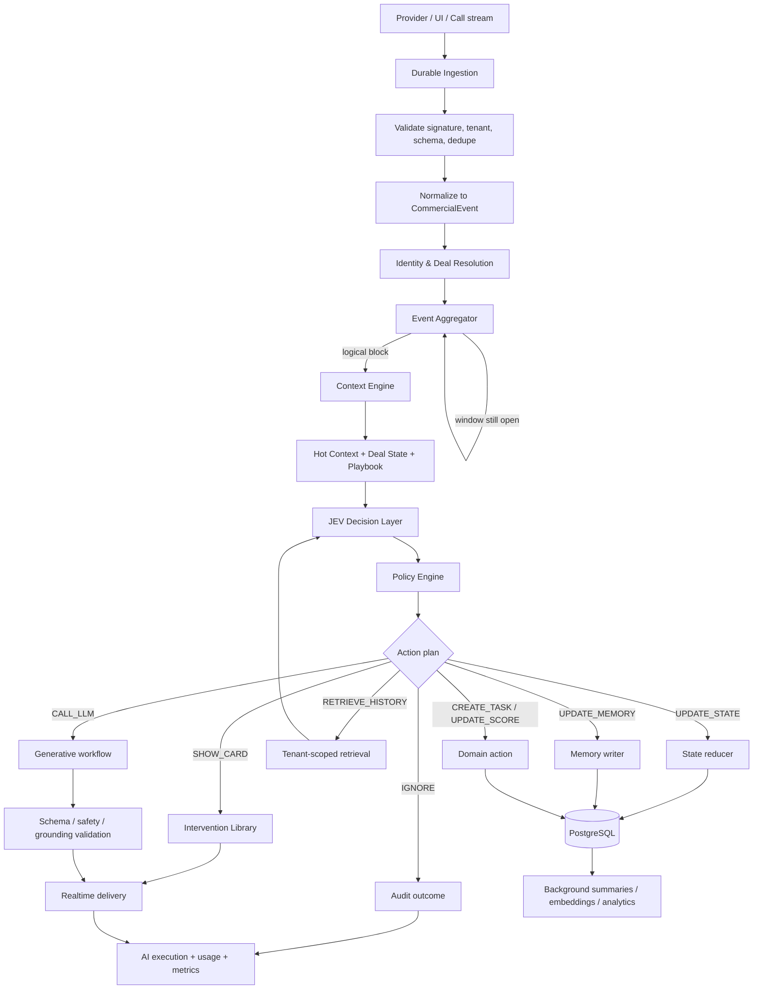
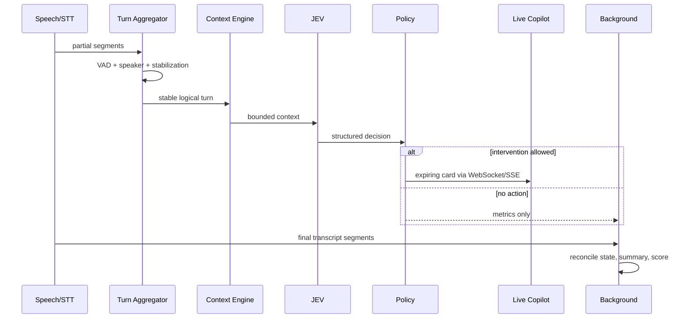

# Morubi — Pipeline de Inteligência Comercial

**Princípio central:** JEV decide; modelos generativos comunicam ou raciocinam em tarefas complexas.  
**Regra de eficiência:** evento novo + contexto mínimo suficiente; nunca reenviar o histórico inteiro por padrão.

## 1. Objetivos

- Transformar canais heterogêneos em eventos comerciais consistentes.
- Atualizar estado/memória incrementalmente, com evidência e versionamento.
- Entregar intervenções rápidas, relevantes e pouco intrusivas.
- Reservar modelos caros para geração/raciocínio que agreguem valor.
- Tornar decisão, custo, latência e falha auditáveis.
- Permitir replay/evals sem reescrever silenciosamente decisões históricas.

## 2. Contrato canônico: `CommercialEvent`

```ts
type CommercialEvent = {
  id: string;
  schemaVersion: number;
  organizationId: string;
  dealId?: string;
  contactId?: string;
  sellerId?: string; // membership, não user global
  conversationId?: string;
  callId?: string;
  source: 'crm' | 'whatsapp' | 'meet' | 'zoom' | 'teams' | 'manual';
  actor: 'lead' | 'seller' | 'manager' | 'system';
  type: 'text' | 'audio' | 'transcript' | 'call_event' | 'note' | 'system_event';
  text?: string; // protegido; pode ser referência no armazenamento
  occurredAt: string; // tempo na origem
  observedAt: string; // tempo de ingestão
  sourceRef: {
    connectionId?: string;
    externalId?: string;
    rawEventId?: string;
  };
  sequenceKey?: string;
  metadata: Record<string, unknown>;
};
```

Invariantes:

- `organizationId` vem da conexão/sessão confiável, nunca do payload sem validação.
- Ao menos um contexto comercial deve existir ou o evento vai para resolução/quarentena.
- Original, transcrição e inferência são distinguíveis.
- Correção/edição cria nova versão ou `supersedes`, preservando proveniência.
- PII e conteúdo não entram em logs/fila se uma referência for suficiente.

## 3. Pipeline end-to-end



## 4. Ingestão e normalização

### Ingestão

1. Validar assinatura, timestamp/nonce e origem.
2. Resolver conexão → organização.
3. Persistir `WebhookEvent`/segmento antes do ack quando aplicável.
4. Deduplicar provider event; responder rapidamente.
5. Publicar job com referência, versão e correlação.

### Normalização

Adapters convertem nomenclaturas do provider para o vocabulário Morubi. A normalização:

- converte timestamps/timezones;
- resolve ator e direção;
- normaliza texto/encoding sem destruir original;
- liga contact/deal/seller por mapeamento com confiança;
- cria/quarentena eventos ambíguos;
- anexa provenance e versão do normalizer;
- emite exatamente um fato canônico por fato semântico, não necessariamente por webhook.

Áudio segue: asset privado → verificação → STT → transcript final → `CommercialEvent(type=transcript)`. O evento original de áudio pode registrar existência/duração, mas só texto final estável alimenta memória oficial. Resultados parciais podem alimentar o live copilot como estado efêmero.

## 5. Event Aggregator

Objetivo: formar **blocos lógicos** sem atrasar indevidamente a ajuda.

### Chave da janela

`organization + conversation/call + actor + thread/turn`. Nunca agregar entre tenants, deals ou atores opostos. Preservar IDs/ordem dos eventos componentes.

### Estratégias iniciais configuráveis

| Contexto                   | Regra inicial                                                                | Fechamento antecipado                                                   |
| -------------------------- | ---------------------------------------------------------------------------- | ----------------------------------------------------------------------- |
| WhatsApp/mensagens rápidas | debounce adaptativo de 3–8 s após última mensagem; máximo 20 s               | mudança de ator, pontuação/intent forte, anexo completo, ação do seller |
| Chat CRM menos fragmentado | 2–5 s; máximo 10 s                                                           | mudança de ator ou evento semântico completo                            |
| Áudio assíncrono           | aguardar transcript final daquele asset                                      | falha/timeout gera status, não análise parcial oficial                  |
| Live call                  | turnos por VAD/speaker; 0,5–1,5 s após segmento estável; janela máxima curta | troca de speaker, pausa forte, sinal urgente                            |
| Import/backfill            | agrupar por thread e intervalos naturais; sem cards live                     | limite de tamanho/token ou mudança de ator                              |

Exemplo: “sim” + “mas achei caro” + “principalmente pela implantação” vira um bloco com três referências e intenção de objeção a preço/implantação.

### Regras de segurança operacional

- Timers no Redis podem acelerar, mas janela e resultado final são persistidos/reconstruíveis.
- Novo evento após fechamento cria novo bloco; não reabre decisão já entregue sem evento corretivo.
- Eventos fora de ordem dentro de tolerância são reordenados; além dela geram recompute assíncrono, não card retroativo confuso.
- Duplicata não reinicia debounce.
- Pressão de fila pode degradar para regras simples/sem geração, nunca misturar contextos.

## 6. Context Engine

Produz um `ContextBundle` com budget explícito:

```ts
type ContextBundle = {
  tenant: { organizationId: string; policyVersion: string };
  trigger: { aggregateEventId: string; componentEventIds: string[] };
  hotContext: EventExcerpt[];
  dealState?: DealStateSnapshot;
  contactFacts?: MemoryFact[];
  sellerSignals?: MemoryFact[];
  playbook: { versionId: string; relevantItems: PlaybookItemRef[] };
  activeInterventions: InterventionRef[];
  permissions: { canGenerate: boolean; canRetrieve: boolean; canPersist: boolean };
  budgets: { latencyMs: number; maxTokens: number; maxCostMicros: number };
};
```

Prioridade: trigger → estado atual → itens de playbook relevantes → poucas interações recentes → fatos necessários. O bundle registra exatamente o que foi usado.

## 7. Memória em camadas

### Hot Context

- Últimos blocos relevantes, compromisso pendente, card ativo e estado da interação.
- Redis/cache para leitura rápida + fonte reconstruível no banco.
- Seleção por recência e relevância, com limite de itens/tokens; não é “últimas N mensagens” cegamente.

### Deal State

Snapshot estruturado atual:

```ts
type DealState = {
  stageSignal?: EvidenceValue<string>;
  intent?: EvidenceValue<'low' | 'medium' | 'high'>;
  dealScore?: EvidenceValue<number>;
  painPoints: EvidenceValue<string>[];
  objections: EvidenceValue<string>[];
  decisionMakers: EvidenceValue<string>[];
  competitors: EvidenceValue<string>[];
  budget?: EvidenceValue<string>;
  timeline?: EvidenceValue<string>;
  nextStep?: EvidenceValue<string>;
  sentiment?: EvidenceValue<string>;
  riskLevel?: EvidenceValue<'low' | 'medium' | 'high'>;
  openQuestions: EvidenceValue<string>[];
};
```

Cada valor inclui `sourceEventIds`, confiança, `observedAt`, status e versão. Update é um reducer/patch validado com optimistic concurrency; conflito reprocessa sobre a versão atual. Informação nova pode confirmar, contradizer, expirar ou superseder — não apenas adicionar.

### Long-Term Memory

- Histórico integral autorizado, summaries hierárquicos, facts e chunks/embeddings.
- Recuperação híbrida: filtros estruturados + recência + full-text + semântica.
- Filtro por tenant/permissão ocorre **antes** do ranking final.
- Chunks mantêm source IDs e offsets para citação/evidência.
- Deleção da fonte invalida derivados e embeddings.

### Seller Memory

- Padrões agregados, competências, preferências e gaps com janela temporal.
- Não expor conversa de outro seller fora do escopo do manager.
- Uso em coaching/assistência deve ser transparente e sujeito à política de pessoas.

### Company Memory

- Padrões agregados, vocabulário e learnings aprovados.
- Não promover inferência única a “verdade da empresa”.
- Amostras pequenas e PII são suprimidas; playbook oficial permanece separado.

## 8. JEV — Decision Layer

JEV é um **contrato lógico de decisão rápida**; a implementação pode combinar regras, classificador pequeno e modelo estruturado. Não é o gerador principal de texto longo.

Perguntas que responde:

1. O que aconteceu (classe/subtipo/sinais)?
2. O estado mudou?
3. Há risco, objeção, buying signal ou mudança de intenção?
4. Intervir agora agrega valor ou distrai?
5. Qual estratégia/template usar?
6. É necessário histórico adicional?
7. É necessário modelo generativo?
8. Quais ações/memórias/scores atualizar?

### Saída versionada

```ts
type JEVDecision = {
  decisionVersion: string;
  classification: {
    type: string;
    subtype?: string;
    confidence: number;
    evidenceEventIds: string[];
  };
  statePatch?: JsonPatch;
  memoryCandidates?: MemoryCandidate[];
  actions: Array<
    | { type: 'IGNORE'; reason: string }
    | { type: 'UPDATE_STATE' }
    | { type: 'UPDATE_MEMORY' }
    | { type: 'SHOW_CARD'; interventionCode?: string; urgency: string }
    | { type: 'RETRIEVE_HISTORY'; queryPlan: RetrievalPlan }
    | { type: 'CALL_LLM'; workflow: string; reason: string }
    | { type: 'CREATE_TASK'; draft: TaskDraft }
    | { type: 'UPDATE_SCORE'; scorecard: string }
    | { type: 'SEND_ANALYTICS_EVENT'; event: string }
  >;
  expiresAt?: string;
};
```

Ações podem coexistir; `IGNORE` é exclusivo. Output é schema-validated. Baixa confiança pode resultar em nenhuma intervenção, retrieval controlado ou revisão assíncrona.

## 9. Policy Engine

Camada determinística depois do JEV. Ela pode vetar/rebaixar ações por:

- tenant, role e escopo do usuário;
- consentimento/gravação e classe de dado;
- feature flag e configuração da organização;
- quota/cost budget e rate limit;
- cooldown/deduplicação de cards;
- estágio, horário e canal;
- confiança mínima, evidência mínima e freshness;
- regras do playbook publicado;
- segurança de outbound write e human approval.

Separar decisão probabilística de política determinística torna o comportamento testável e impede que o modelo conceda permissões.

## 10. Intervention Library

Taxonomia exemplo:

```text
PRICE_OBJECTION
├── budget_constraint
├── competitor_comparison
├── low_value_perception
├── procurement_pressure
└── premature_discount
```

Template contém título, explicação, estratégia, perguntas, warning, next step, condições, idioma, canal, playbook version e critérios de expiração.

Seleção:

1. filtrar templates aplicáveis ao playbook/idioma/canal;
2. avaliar conditions e subtipo;
3. rankear por especificidade, performance histórica e contexto;
4. preencher apenas slots seguros;
5. Policy Engine deduplica e autoriza;
6. se nenhum servir, considerar LLM — não chamar automaticamente.

Feedback (`useful`, `dismissed`, `wrong`, ação realizada) alimenta avaliação, não muda template oficial sozinho.

## 11. Historical Retrieval

Retrieval é uma ação explícita, não reflexo automático.

- Query plan define scopes permitidos, filtros, período, tipos e budget.
- Buscar primeiro estado/fatos/summaries; só então chunks originais se necessário.
- Combinar lexical/semantic/recency e reranking pequeno.
- Retornar trechos com source refs, tempo, autor e confiança.
- Nunca recuperar company/seller memory de escopo não autorizado.
- Sanitizar conteúdo externo contra prompt injection; conteúdo recuperado é dado, não instrução.
- Registrar IDs recuperados, não necessariamente conteúdo em log.

## 12. Quando chamar modelo generativo

Chamar se a tarefa exige linguagem personalizada ou síntese não coberta por template e o ganho supera custo/latência:

- resposta sugerida personalizada;
- resumo complexo e pós-call;
- coaching, roleplay e assessment;
- relatório/diagnóstico gerencial;
- reconciliação de evidências ambíguas autorizada;
- explicação legível de múltiplos fatores.

Não chamar para simples roteamento, dedupe, permissão, lookup, cálculo, template adequado ou transformação determinística.

### Workflow de geração

1. escolher workflow/model tier por feature, risco e budget;
2. montar input mínimo e demarcar dados não confiáveis;
3. exigir saída estruturada quando houver ação de sistema;
4. timeout e uma política de retry segura;
5. validar schema, citações, policy e groundedness;
6. fallback: modelo menor/alternativo, template ou “sem recomendação”; nunca inventar;
7. persistir output versionado e uso.

## 13. Atualização de memória

Memory candidates passam por validação:

- relevância futura;
- atomicidade;
- evidência explícita;
- confiança e sensibilidade;
- duplicata/conflito;
- escopo e retenção;
- proibição de inferências sensíveis não necessárias.

Fatos voláteis têm validade/TTL. Fatos críticos (orçamento, decisor, consentimento) podem exigir confirmação humana ou múltiplas evidências. Summary não substitui mensagem/transcript como prova.

## 14. Live call



Regras:

- Cards live têm TTL e identificam transcrição parcial.
- Correção do STT pode invalidar/retrair card.
- Não gerar texto longo enquanto o seller precisa ouvir.
- Degradação: transcript local/visual → regras essenciais → sem cards; call continua.
- Pós-call reconcilia transcript final e não trata inferência parcial como fato final.

## 15. Scores

- `DealScore` e `CallScore` são scorecards versionados por organização/playbook.
- Exibir fatores positivos/negativos, evidências, confiança e data.
- Feature inputs devem ser definidos; não treinar silenciosamente em outcomes futuros que causem leakage.
- Comparações só entre versões/coortes compatíveis.
- Correção humana e outcome real alimentam eval; mudança de fórmula exige backtest e versão nova.

## 16. Observabilidade, custo e auditoria

Para cada workflow: organização, ator, recursos, feature, versões de context/JEV/policy/prompt, provider/model, latência, tokens/cache/audio seconds, custo estimado, status, retries, fallback e trace.

Controles:

- budget por execução, feature, organização e período;
- soft limit alerta/degrada; hard limit bloqueia apenas conforme política explícita;
- roteamento small-first e cache apenas para inputs não sensíveis/equivalentes;
- custo atribuído a seller, call, conversa e feature por ledger;
- conteúdo de prompt/output separado da telemetria, cifrado e com retenção menor;
- kill switch por workflow/provider/model.

## 17. Evals e promoção

- Dataset sanitizado e versionado por taxonomia: objeção, signal, risco, no-action e casos adversariais.
- Métricas: precision/recall por classe, falso card por hora, aceitação, groundedness, schema validity, latência e custo.
- Avaliar por canal, idioma, stage e organização sem vazar tenant.
- Shadow mode antes de mostrar cards; canary por organização; rollback de configuração/modelo.
- Revisão humana estratificada, com acordo entre avaliadores.
- Produção monitora drift de distribuição e feedback; não aprende online sem governança.

## 18. Falhas e idempotência

- Cada aggregate event possui uma decision execution idempotente por workflow version.
- Retry de provider não duplica task/card/state patch.
- Estado usa versão/compare-and-swap.
- Timeout generativo não impede update determinístico.
- Provider indisponível degrada para biblioteca/sem intervenção.
- DLQ e replay preservam versão original; reprocessamento com versão nova cria resultado novo, não reescreve auditoria.

## 19. OPEN QUESTIONS

1. Especificação real do JEV: modelo existente, latência, contrato e capacidade de fine-tuning?
2. Limites p95 e custo por interaction/live minute aceitáveis comercialmente?
3. Quais categorias de intervenção entram no primeiro golden dataset?
4. Provedores de STT/LLM/embedding e política de uso de dados/zero retention?
5. Quais fatos exigem confirmação humana antes de entrar no `DealState` ou CRM?
6. Como medir utilidade de card sem incentivar cliques artificiais?
7. Qual idioma/variação regional e qualidade mínima de diarização no piloto?

# Estado implementado — Fase 4 (2026-10-06)

O primeiro vertical executável do pipeline está em `@morubi/intelligence` e `@morubi/db`. Ele implementa `ContextRetriever`/`ContextBuilder`, `DecisionProvider`, validação Zod, Policy Engine configurável, State/Memory Update Engines, Intervention Library, persistência de decisão/usage e dispatcher inline.

O provider ativo é `FixtureDecisionProvider`; JEV real não foi integrado porque não há contrato ou credencial verificável. A chave de processamento inclui evento, decisão, contexto, policy e modelo. Histórico textual PostgreSQL só é carregado quando solicitado e permanece limitado. Shadow mode é obrigatório por padrão e nenhuma intervenção chega ao seller.

O corpus offline contém 55 conversas e 110 eventos sintéticos, com labels dourados e métricas por categoria/calibração. Isso testa o pipeline, não certifica qualidade de modelo real. O desenho operacional completo está em `INTELLIGENCE_ENGINE.md`.

## Estado implementado — Fase 5 (2026-10-06)

Após a candidata, um estágio determinístico resolve owner da oportunidade, shadow/visible, flags, template, prioridade, limiar, cooldown, dedupe, máximo por janela e expiração. Informação neutra e `GENERATION_REQUIRED` não chegam ao seller. Uma transação grava delivery e outbox; mudança de `DealState` também publica evento quando realtime está ligado.

O request apenas ingere e enfileira. `intelligence_jobs` usa claim com `SKIP LOCKED`, retry limitado e processing key idempotente. Latências de contexto/decisão/policy continuam separadas e delivery registra `end_to_end_latency_ms`. Feedback não recalibra decisão online; alimenta métricas e evals. O harness exporta expected/actual/delivered em JSON/CSV.

## Estado implementado — Fase 6 (2026-10-07)

`GENERATION_REQUIRED` agora cria um `generation_job` na mesma transação da candidata. Templates, `SUPPRESS` e confidence insuficiente encerram antes desse ponto e não chamam provider. O `GenerativeRouter` escolhe somente `FAST_GENERATION` ou `DEEP_REASONING`; estratégia e autorização continuam vindas da decisão/policy.

O `GenerationInput` reutiliza o contexto já recuperado e limita evento, state, memórias, hot context e playbook. O sanitizador redige PII óbvia e remove IDs. O prompt separa system role, regras da organização, estratégia, contexto não confiável e contrato JSON. A saída passa por Zod, regras comerciais, regras da organização e validator de playbook, com no máximo um retry de correção.

Execução válida ainda depende de budget, teto por intervenção, staleness e delivery policy. Falha, timeout, circuit breaker, output `INVALID|REVIEW_REQUIRED` ou evento/decisão mais novo suprimem sem erro para o seller. `AIUsage` registra tokens/custo nas dimensões de organização, seller, conversa, deal, intervenção, provider, model e profile. O corpus específico possui 56 casos e export para revisão humana; detalhes em `GENERATIVE_INTELLIGENCE.md`.

## Estado implementado — Fase 7 (2026-10-07)

Mensagens `AUDIO` ganham um estágio assíncrono anterior ao pipeline: validação/hash/storage, `transcription_job`, provider fixture ou Gemini e `AudioTranscript` versionado. Saída vazia/inválida, arquivo corrompido, source tombstoned ou falha terminal não cria evento falso.

Transcript aprovado retorna ao caminho canônico como `CommercialEvent` textual com provenance e horário original. O Intelligence Engine não possui branching de áudio; apenas impede que evento antigo concluído tarde regrida o estado atual. DeepSeek continua restrito ao estágio `GENERATION_REQUIRED`. Custos e usage de transcrição entram no mesmo ledger. Consulte `AUDIO_INTELLIGENCE.md`.

## Live Calls (Fase 8)

O realtime possui um contrato de streaming separado do batch da Fase 7. Partial é efêmero; somente turno final idempotente cria `CommercialEvent(contentOrigin=CALL_TRANSCRIPT)`. O evento entra na mesma `intelligence_jobs` com prioridade 100, deadline curta e `source=LIVE_CALL`; não existe um Live Intelligence Engine paralelo.

Cards carregam session/turn IDs, TTL curto e staleness por sequência. Geração live requer gate próprio, além dos gates generativos existentes, e começa desligada. Provider real não foi selecionado; CI e simulator usam fixture. Consulte `LIVE_CALLS.md`.
