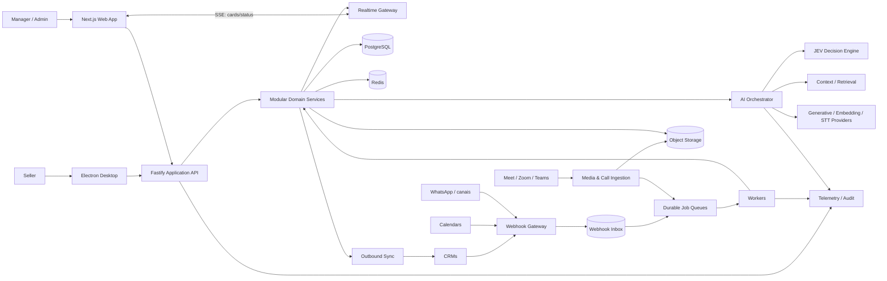
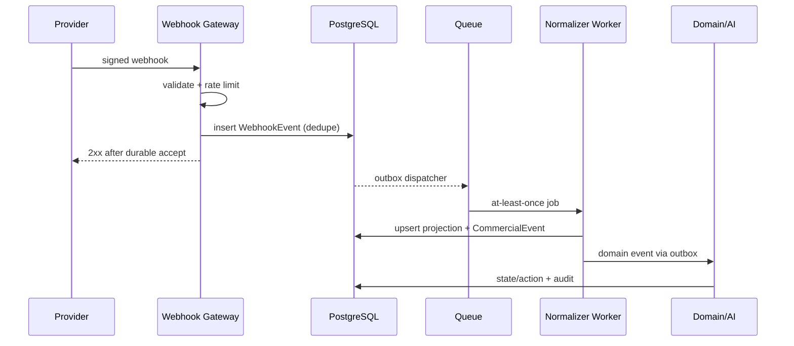
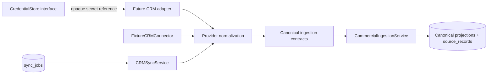

# Morubi — Arquitetura Técnica

**Status:** arquitetura alvo inicial; decisões irreversíveis exigem validação  
**Baseline do repositório (2026-10-05):** diretório vazio, sem Git, código, dependências, configuração ou schema existente

## 0. Avaliação do repositório atual

Foram inspecionados a raiz, arquivos ocultos e até três níveis de profundidade. O diretório contém apenas a documentação criada nesta etapa; antes dela, estava vazio. Portanto:

- não há README, `package.json`, lockfile, `tsconfig`, app, testes ou CI;
- não há schema, migration, ORM, banco ou infraestrutura declarada;
- não há Git inicializado nem histórico para inferir decisões anteriores;
- não há código funcionando a preservar ou conflito de worktree;
- nenhuma escolha de stack pode ser descrita como existente.

O problema imediato não é dívida de código, mas **risco de decisões prematuras sem requisitos operacionais**: cloud/região, auth, CRM piloto, volume, JEV e política de gravação ainda estão abertos. Esta arquitetura é uma proposta coerente para iniciar, não uma validação de implementação existente.

## 1. Direção arquitetural

Começar com **backend modular central e clientes separados**, organizado por domínios e contratos compartilhados. O seller usa um aplicativo Electron desktop-first; managers/admins usam Next.js web; ambos consomem uma API Fastify dedicada. Workers assíncronos serão adicionados somente nas fases que os exigirem. Isso reduz custo operacional sem misturar domínio com UI ou processo nativo.

Não iniciar com microserviços. As fronteiras são lógicas, filas carregam trabalho durável e processos podem ser implantados separadamente quando latência, escala ou isolamento justificarem.

## 2. Stack proposta

Como não há stack existente, esta é uma recomendação greenfield:

| Camada            | Escolha inicial                      | Razão                                                                           |
| ----------------- | ------------------------------------ | ------------------------------------------------------------------------------- |
| Desktop seller    | Electron + React + Vite + TypeScript | Presença no fluxo do seller e base para capacidades nativas futuras             |
| Web manager/admin | Next.js App Router + TypeScript      | Dashboard de gestão, onboarding e administração                                 |
| UI                | Tailwind + Radix/shadcn              | Componentes acessíveis e identidade própria sem framework visual rígido         |
| API               | Fastify + TypeScript                 | Backend dedicado, leve, com hooks de auth/tenancy e fronteira HTTP estável      |
| Contratos         | Zod + OpenAPI gerado/validado        | Validação em runtime e integração testável                                      |
| Banco             | PostgreSQL                           | Transações, JSONB criterioso, full text e row-level controls opcionais          |
| ORM               | Drizzle                              | SQL visível, migrations revisáveis e suporte explícito a PostgreSQL/RLS         |
| Cache/ephemeral   | Redis                                | cache curto, rate limit, locks e estado efêmero; nunca fonte de verdade         |
| Filas             | BullMQ sobre Redis no MVP            | operação simples no início; migrar se requisitos de durabilidade/escala pedirem |
| Objetos           | Storage S3-compatible                | áudio, gravações, exports e artefatos com URLs assinadas                        |
| Observabilidade   | OpenTelemetry + logs/métricas/traces | correlação entre request, job, sync e execução de IA                            |
| Deploy            | containers + serviços gerenciados    | portabilidade sem antecipar Kubernetes                                          |

Drizzle foi confirmado para a fundação. O runtime usa uma role PostgreSQL separada da role de migration, `SET LOCAL` por transação e policies RLS reais.

## 3. Contextos de domínio

- **Identity & Tenancy:** users, organizations, memberships, teams, roles, permissions.
- **Integration Hub:** conexões, credenciais referenciadas, webhooks, sync, mapeamentos e cursores.
- **Revenue Projection:** contatos, deals, stages e atividades espelhadas do CRM.
- **Conversation Intelligence:** conversas, mensagens, mídia, `CommercialEvent`, agregação e estado.
- **Call Intelligence:** calls, participantes, transcript, live state, summaries e scores.
- **Playbook:** conteúdo estruturado, versões e intervenções.
- **Decision & Generation:** Context Engine, JEV, Policy Engine, retrieval, providers e guardrails.
- **Actioning:** cards, tarefas, notificações e outbound sync.
- **Analytics & Coach:** métricas, insights, cenários, avaliações e evolução.
- **Platform:** usage, quotas, auditoria, retenção, observabilidade e feature flags.

Cada módulo expõe application services e eventos; acesso direto às tabelas de outro módulo deve ser excepcional e documentado.

## 4. Visão de componentes



## 5. Clientes

### Desktop Electron

- Main process controla janela, lifecycle, sessão segura, APIs nativas e futura captura/updater.
- Preload expõe bridge tipada e allowlisted; renderer nunca recebe Node, filesystem, cookie ou token.
- Renderer React é UI local empacotada, com `contextIsolation`, sandbox e `nodeIntegration: false`; o preload sandboxed é um bundle CommonJS compatível com as restrições do Electron.
- Navegação externa e criação de janelas são negadas por padrão; permissões nativas também.
- Sessão Better Auth é mantida pelo main e cifrada com `safeStorage`; indisponibilidade de criptografia falha de forma fechada.
- Uma janela principal agora; overlays/copilot/tray/deep links/auto-update ficam preparados, não implementados.

### Web Next.js

- Focado em manager/admin/owner, onboarding e organização.
- Better Auth usa cookie `HttpOnly`; organização ativa é apenas uma seleção do cliente e nunca autoridade.
- Better Auth usa um pool exclusivo (`AUTH_DATABASE_URL`) autenticado como `morubi_auth`. API e worker de domínio continuam exclusivamente em `DATABASE_URL`/`morubi_app`; migrations usam a URL administrativa. O domínio consulta identidades necessárias por uma interface do módulo auth, sem conceder acesso de tabela a `morubi_app`.
- Em desenvolvimento, as únicas origens de auth são `WEB_ORIGIN` e `DESKTOP_DEV_ORIGIN`; em produção, localhost é substituído por `DESKTOP_APP_ORIGIN` (`morubi-app://app`). O Electron main envia `Origin` explicitamente e mantém cookies cifrados fora do renderer.
- App Router e shell responsivo; backend de domínio não reside em routes/server actions do Next.js.

### Regras comuns

- App shell com autorização derivada do servidor; esconder navegação não substitui verificação da API.
- Server state via camada de query; estado local somente para interação. Evitar store global para dados de negócio.
- Componentes de domínio por módulo e contratos gerados/compartilhados.
- SSE para cards, progresso de sync e pós-call; WebSocket somente no live copilot bidirecional.
- Optimistic UI apenas para operações reversíveis; ações de sync mostram estado pendente/confirmado/falhou.
- Identificar conteúdo inferido, confiança, evidência, versão e freshness.
- Telemetria de UX sem gravar conteúdo sensível por padrão.

## 6. Backend e APIs

- API orientada a recursos/ações, versionada quando exposta a terceiros.
- Toda entrada passa por autenticação, resolução de membership, autorização, validação e `organization_id` derivado do contexto confiável.
- Nunca aceitar `organization_id` do body como autoridade.
- Comandos com efeito externo recebem `idempotency_key`.
- Paginação por cursor; timestamps UTC; timezone IANA no perfil/organização.
- Erros com código estável e `trace_id`, sem stack ou secret.
- Operações longas retornam job/status em vez de manter request aberto.

## 7. Data layer e multi-tenancy

- PostgreSQL compartilhado com schema compartilhado no início, `organization_id NOT NULL` em toda entidade tenant-owned.
- Índices e uniques começam por `organization_id`.
- Repositories exigem `TenantContext`; lint/testes impedem métodos tenant-owned sem contexto.
- RLS do PostgreSQL está habilitado e forçado nas tabelas tenant-owned como defesa adicional, sem substituir autorização. O contexto usa `set_config(..., true)` dentro da transação para não vazar entre conexões do pool; o runtime usa papel sem ownership e sem `BYPASSRLS`.
- Mutações de owner são serializadas por organização com advisory lock transacional; somente owner pode promover, remover ou despromover outro owner.
- `audit_logs` aceita `SELECT`/`INSERT` tenant-scoped no runtime, sem `UPDATE`/`DELETE`.
- Tabelas globais são allowlist pequena (catálogo de providers, por exemplo) e não contêm dados do cliente.
- IDs internos UUIDv7/ULID; IDs externos são guardados com provider e conexão em constraints compostas.
- Conteúdo flexível em JSONB somente quando não há necessidade clara de constraint/query; campos operacionais permanecem tipados.

## 8. Event architecture

Há três conceitos distintos:

1. **Provider event:** payload bruto recebido, imutável, com retenção curta e acesso restrito.
2. **CommercialEvent:** fato comercial canônico normalizado, definido em `AI_PIPELINE.md`.
3. **Domain event:** notificação interna sobre mudança confirmada (`DealStateUpdated`, `CallFinalized`).

Não confundir os três nem usar `CommercialEvent` como barramento técnico genérico.

### Confiabilidade

- Webhook é persistido no inbox antes de responder `2xx`.
- Deduplicação por `(organization_id, connection_id, provider_event_id)`; fallback por fingerprint versionado.
- Transação grava mudança de domínio + outbox.
- Dispatcher publica outbox na fila; consumer registra inbox/execução idempotente.
- Entrega é at-least-once; handlers devem tolerar repetição e eventos fora de ordem.
- Dead-letter queue, replay autorizado e ferramentas de reconciliação são requisitos operacionais.

### Vertical implementado na Fase 2

O primeiro núcleo comercial está organizado em quatro camadas:

1. DTOs canônicos em `@morubi/domain`, sem tipos de SDK de CRM.
2. `CommercialIngestionService` em `@morubi/db`, que serializa por identidade externa, registra `source_records`, evita regressão por `provider_updated_at` e atualiza a projeção na mesma transação.
3. Repositórios tenant-scoped de contato, deal e conversa, com cursor pagination e read models montados em lotes para evitar N+1.
4. Fastify expõe somente leitura autenticada em `/v1/contacts`, `/v1/deals`, `/v1/conversations` e mensagens; não existe CRUD genérico nem integração real nesta fase.

O desktop acessa essas rotas exclusivamente pelo main process e pela bridge IPC allowlisted. Conversas usam três colunas (threads, mensagens e contexto); Oportunidades e Contatos exibem origem e freshness. O web oferece listas read-only de contatos e oportunidades para manager/admin.

`CommercialEvent` é append-only. Provider event bruto (`source_records`), fato comercial e futuro domain event continuam objetos distintos. Logs operacionais carregam IDs e metadata, nunca texto de mensagem.



## 9. Sincronização e consistência

- CRM domina campos importados; Morubi domina inferências, memories, scores, feedback e configurações próprias.
- Campos outbound têm ownership explícito: `external`, `morubi`, `human-approved`.
- Webhook fornece baixa latência; sync incremental reconcilia perdas; backfill é paginado e pausável.
- `source_updated_at`, `observed_at` e `synced_at` evitam confundir tempo de origem com tempo de ingestão.
- Atualização externa fora de ordem não pode regredir versão mais nova.
- UI mostra `data_freshness` e estado da conexão.

## 10. Assíncrono e filas

Filas separadas por perfil de carga e prioridade:

| Fila                | Exemplos                               | SLO inicial indicativo            |
| ------------------- | -------------------------------------- | --------------------------------- |
| `realtime-decision` | agregação encerrada, JEV, policy, card | p95 < 2 s após bloco textual      |
| `live-call`         | transcript parcial, sinais, cards      | p95 < 1,5 s após segmento estável |
| `ingestion`         | normalize, projection, attachments     | segundos                          |
| `media`             | transcrição/diarização/finalização     | proporcional à duração            |
| `generation`        | summaries, feedback, relatório         | minutos                           |
| `sync`              | backfill, reconcile, outbound          | minutos                           |
| `analytics`         | métricas, insights, embeddings         | batch/eventual                    |
| `privacy`           | export, delete, retention              | SLA administrativo definido       |

Cada job possui tenant, tipo, versão de payload, correlação, tentativas, deadline, idempotency key e referência ao dado — não conteúdo sensível desnecessário. Backoff com jitter; falhas permanentes não são repetidas indefinidamente.

## 11. Real-time

- **SSE como padrão server → client:** cards, atualização de `DealState`, progresso de job e notificações. Simples, reconectável e compatível com HTTP; usar event ID para retomada.
- **WebSocket para live call:** transporte bidirecional/baixa latência, sessão efêmera e presença. Áudio deve preferir mecanismo/provider de mídia próprio, não frames arbitrários no socket da UI.
- **Polling como fallback:** telas não críticas, refresh de status e ambientes onde conexão persistente falhar; usar ETag/backoff.
- Eventos real-time carregam referência e versão, não transcript inteiro. Autorização é revalidada na conexão e periodicamente; revogação encerra sessão.

## 12. Cache

- Cache-aside de playbook publicado, permissions resolvidas, hot context e configurações estáveis.
- Chaves incluem organização, recurso e versão.
- TTL curto + invalidação por domain event; cache miss nunca muda semântica de autorização.
- Locks Redis protegem concorrência operacional, mas invariantes finais vivem no PostgreSQL.
- Hot context persistível/reconstruível; perda do Redis não pode apagar memória oficial.

## 13. Storage e mídia

- Bucket/prefixo segregado por ambiente e organização, com políticas IAM mínimas.
- Objetos privados, criptografados e acessados por URL assinada curta.
- Upload multipart direto autorizado; malware/content-type/size checks antes de processar.
- Metadados no PostgreSQL, binário no object storage.
- Lifecycle por classe: áudio bruto, gravação, transcript, export e artefatos derivados podem ter retenções diferentes.
- Exclusão usa tombstone + job auditável e confirmação do storage/backups conforme política.

## 14. Arquitetura de IA

O AI Orchestrator não é um endpoint livre de prompt. Ele executa workflows versionados:

1. carrega Context Bundle tenant-scoped;
2. executa JEV (decisão estruturada);
3. aplica Policy Engine determinístico;
4. usa Intervention Library quando possível;
5. recupera histórico somente se autorizado/necessário;
6. chama modelo generativo quando há ganho claro;
7. valida output, persiste ação/estado e registra uso.

Providers ficam atrás de interfaces para STT, embeddings, classificação e geração. Troca de provider não deve alterar contratos de domínio. Detalhes estão em `AI_PIPELINE.md`.

## 15. Observabilidade

- `trace_id`, `request_id`, `job_id`, `ai_execution_id` e `sync_job_id` correlacionáveis.
- Logs estruturados com allowlist; redaction de token, mensagem, transcript e PII por padrão.
- Métricas: latência/erro/fila, freshness, dedupe, retries, custo/tokens/minutos, cards aceitos e drift de qualidade.
- Traces atravessam API → outbox → worker → provider, sem conteúdo sensível.
- Audit log append-only registra ações de segurança/admin e acesso excepcional a conteúdo.
- Alertas por SLO e budget, não por volume bruto isolado.

## 16. Deploy e ambientes

- Ambientes separados (`local`, `staging`, `production`) com contas/buckets/segredos distintos.
- Web/API, realtime gateway e workers podem compartilhar código e ter deploy/escala independentes.
- Migrations forward-only, revisadas, com expansão/contração para mudanças incompatíveis.
- Feature flags por organização para integrações e IA; kill switch por provider/workflow.
- Backups com teste periódico de restauração; RPO/RTO devem ser definidos antes do piloto pago.
- IaC é desejável na fundação, mas provider de cloud permanece pergunta aberta.

## 17. Estrutura de workspace implementada

```text
apps/
  desktop/             # Electron main/preload/renderer
  web/                 # Next.js para manager/admin
  api/                 # Fastify, backend central
packages/
  contracts/           # schemas Zod e eventos versionados
  db/                  # schema, repositories e migrations
  domain/              # módulos e application services
  auth/                # Better Auth server configuration
  permissions/         # matriz RBAC e policies
  validation/          # fronteiras Zod
  ui/                  # primitives e tokens compartilháveis
  config/              # validação tipada de ambiente
docs/
```

Evitar pacote `shared` genérico; cada dependência deve ter dono e direção clara.

## 18. Requisitos de qualidade

- Testes unitários para policy, mapping, score e transições.
- Contract tests por connector e provider de IA.
- Integration tests com PostgreSQL/Redis reais em containers.
- Testes de isolamento tenant negativos obrigatórios.
- Replay tests com payloads sanitizados e golden datasets versionados.
- E2E dos fluxos críticos; load/soak para webhook, aggregation e live call.
- Evals offline e canary antes de promover versão de workflow/modelo.

## 19. Evolução e gatilhos para extração

Extrair um serviço somente quando houver evidência:

- perfil de escala/latência incompatível com o restante;
- blast radius ou compliance distinto;
- equipe/ritmo de deploy independente;
- runtime especializado necessário;
- fronteira e contrato já estabilizados.

Candidatos naturais: mídia/transcrição, realtime de calls e analytics pesado. Identity, tenancy e core projections devem permanecer simples no início.

## 20. Suposições e perguntas abertas

- **ASSUMPTION A-01:** monorepo TypeScript, Electron desktop-first, Next.js web, Fastify e PostgreSQL foram mandatados/confirmados para a fundação.
- **ASSUMPTION A-02:** consistência eventual de segundos/minutos é aceitável fora do live copilot.
- **ASSUMPTION A-03:** uma região atende o piloto; arquitetura não promete data residency multi-região.

### OPEN QUESTIONS

1. Cloud/região, RPO, RTO e SLO contratual.
2. Volume esperado de organizações, eventos/dia, horas de call e concorrência live.
3. Necessidade de browser extension/bot de reunião versus importação pós-call no primeiro ciclo.
4. Provedor inicial de auth, filas, STT, embeddings e geração.
5. JEV será serviço/modelo existente ou workflow a ser construído?

## 21. Vertical provider-agnostic da Fase 3 (2026-10-06)

O placeholder `PILOT_CRM_PROVIDER = "<CRM_ESCOLHIDO>"` não foi substituído. Por isso, a entrega para no boundary anterior ao adapter real e não cria OAuth, webhook ou chamadas externas por suposição.

A infraestrutura adicionada segue esta direção:



- `@morubi/integrations` contém o contrato CRM estritamente read-only, capabilities, cursores opacos, classificação de erros, retry e redaction.
- DTOs do provider ficam dentro do adapter. Somente `NormalizedContactRecord` e `NormalizedDealRecord` atravessam o boundary.
- `FixtureCRMConnector` é um adapter sintético exclusivo de testes; não representa um CRM escolhido.
- `crm_connections` e `sync_jobs` são fonte persistente de status e checkpoint. O mesmo índice parcial impede dois jobs `PENDING|RUNNING` para a mesma conexão.
- O executor pagina contacts antes de deals, resolve relacionamentos pela identidade externa e chama somente `CommercialIngestionService`.
- Checkpoint avança apenas após a página inteira persistir. Falha isolada deixa o job `PARTIAL`, mantém o último checkpoint seguro e permite replay idempotente.
- Redis/BullMQ e o executor de `sync_jobs` do CRM foram adiados: não há adapter real nem operação autorizada pela ausência do provider. `SyncJob` já separa solicitação de execução para uma fila futura. O processo dedicado criado depois para inteligência não habilita sincronização CRM.
- A API expõe apenas leitura de status. Endpoints de conectar, sincronizar e desconectar não são publicados enquanto auth, revogação e execução assíncrona reais não existirem.

## 22. Intelligence Engine da Fase 4 (2026-10-06)

A Fase 4 adiciona `@morubi/intelligence` como módulo puro entre o modelo canônico e o data layer. Ele contém contratos estruturados, Context Builder, provider fixture, reducers, policy, matching e evals; não importa Drizzle nem SDK externo. `@morubi/db` implementa `ContextRetriever`, persistência e o processador transacional.

O fluxo usa `CommercialEvent` como gatilho, contexto limitado, output validado e policy determinística. PostgreSQL guarda `DealState` atual, revisões, memória, decisão, candidata e usage. A chave composta por evento e versões permite replay sem duplicata e reprocessamento deliberado. A abstração mínima de dispatcher aceita uma fila futura sem introduzir Redis/BullMQ nesta fase.

JEV permanece um boundary não implementado por falta de contrato real. A execução local usa somente `FixtureDecisionProvider`, sempre em shadow mode. Detalhes e budgets estão em `INTELLIGENCE_ENGINE.md`.

## 23. Vertical slice do CRM Copilot (Fase 5)

O caminho síncrono termina após `Message`, `CommercialEvent` e `intelligence_jobs`. Um worker tenant-scoped executa o engine idempotente, a delivery policy e a outbox. PostgreSQL é fila e replay log nesta escala; nenhum cálculo pesado de inteligência roda no handler HTTP.

Realtime usa SSE versionado. API autentica sessão/membership, resolve tenant e filtra `seller_membership_id`; Electron main mantém cookie, reconnect/backoff e `Last-Event-ID`, valida Zod e publica IPC fechado. Preload não expõe fetch genérico nem secret. Renderer reage a `intervention.*` e `deal_state.updated`.

As fronteiras novas são `IntelligenceJobRepository`, `CopilotRepository`, `DesktopRealtimeClient` e `MorubiCopilotPanel`. Na Fase 6, o loop de processamento saiu da API e passou a `apps/worker`. Um broker pode reduzir polling no futuro, mas não substitui a outbox. Consulte `CRM_COPILOT.md`.

## 24. Generative Intelligence e worker dedicado (Fase 6)

`@morubi/ai` é o boundary independente de fornecedor para `GenerativeProvider`, perfis lógicos, router, prompt, sanitização, validação, estimativa de custo e avaliação. A implementação DeepSeek existe somente no adapter; domínio e banco conhecem provider/model como metadata. Os dois gates de ambiente e o gate por tenant começam desligados.

Geração sucede decisão, policy e tentativa de template. `GENERATION_REQUIRED` cria `generation_jobs`; `apps/worker` consome tanto intelligence quanto generation jobs em processo separado. PostgreSQL permanece fila durável com `SKIP LOCKED`, backoff, tentativas limitadas e recuperação de locks, sem introduzir Redis. A API mantém HTTP, auth, ingress, queries e SSE.

Cada job é processado na role runtime tenant-scoped; uma conexão coordenadora administrativa serve apenas para descobrir filas. `generation_jobs` e `generative_executions` possuem FKs compostas, RLS forçado e chaves idempotentes. Contexto é compacto, sanitizado e delimitado como não confiável. Output só se torna candidata `GENERATED` após schema, business/company/playbook validation, cost policy e duas verificações de staleness.

O worker suporta shutdown gracioso e telemetria sem conteúdo: queue depth aproximada, claims, conclusões, falhas, retries e latência. Prompt/resposta completos não são registrados em logs. O desenho detalhado está em `GENERATIVE_INTELLIGENCE.md`.

## 25. Audio Intelligence assíncrona (Fase 7)

`@morubi/storage` adiciona um boundary de object storage independente de nuvem; `LocalObjectStorage` serve somente DEV/TEST. `@morubi/ai` agora isola `TranscriptionProvider`, fixture e Gemini. `@morubi/db` coordena ingestão, assets, transcripts versionados e jobs. O mesmo `apps/worker` processa, em ordem, transcription, intelligence e generation.

O áudio nunca segue diretamente para geração. A promoção cria `CommercialEvent` textual com `content_origin=AUDIO_TRANSCRIPT` e `occurred_at` original; dali em diante o pipeline é o mesmo de texto. Eventos atrasados entram na timeline, mas não regressam `DealState`. Renderer recebe bytes somente por bridge/API autorizada, sem path de filesystem. Veja `AUDIO_INTELLIGENCE.md`.

## 26. Live Calls desktop (Fase 8)

`@morubi/live-calls` contém contratos puros de detecção, captura, STT realtime, agregação, memória, fases, buffer e política de cards. O desktop hospeda o adapter autorizado de microfone e a UI; API e `@morubi/db` controlam lifecycle, consentimento, turns e tenancy; o worker existente recupera sessões stale e processa o mesmo pipeline de intelligence/generation.

O único caminho para inferência continua sendo `CommercialEvent`. Turno final de call vira `CALL_TRANSCRIPT` e job prioritário na fila PostgreSQL já existente; partial nunca altera estado. Provider realtime, observadores reais de Meet/Zoom e áudio do sistema continuam boundaries não implementados. Veja `LIVE_CALLS.md`.

# Fase 9 — post-call intelligence

Após `LiveCallSession(ENDED)`, a API enfileira análise durável no PostgreSQL. O worker segmenta o transcript, usa o mesmo `GenerativeProvider` com perfil `POST_CALL_ANALYSIS`, valida evidências e persiste revisões imutáveis. O modelo apenas propõe atualizações; `IntelligenceProcessor` permanece a autoridade de DealState/Memory. Consulte [POST_CALL_INTELLIGENCE.md](./POST_CALL_INTELLIGENCE.md).
