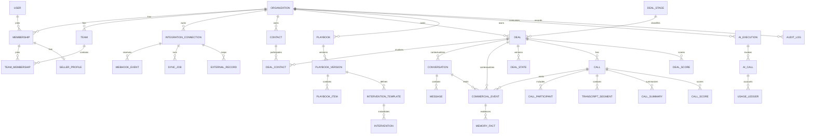

# Morubi — Modelo de Dados Proposto

**Status:** modelo conceitual com subconjunto implementado nas migrations `0000` a `0002`  
**Banco alvo:** PostgreSQL  
**Regra central:** todo registro de negócio pertence explicitamente a uma organização

## 1. Convenções

- PK: UUIDv7 (ou ULID armazenado de modo consistente), gerado pela aplicação.
- Colunas tenant-owned: `organization_id NOT NULL` e FK para `organizations(id)`.
- Datas: `timestamptz` em UTC; timezone IANA guardado separadamente quando relevante.
- Soft delete somente onde restauração/auditoria justificarem: `deleted_at`; não usar como substituto de retenção.
- Proveniência externa: `connection_id`, `external_id`, `source_updated_at`, `synced_at`.
- Conteúdo inferido: `workflow_version`, `model_ref`, `confidence`, `evidence_refs`, `computed_at`.
- JSONB guarda payload variável/metadata, não campos usados como invariantes centrais.
- Valores monetários: inteiro em menor unidade + código ISO de moeda.
- Identificadores/e-mails normalizados em colunas próprias; texto original preservado quando necessário.
- Toda unique/index tenant-owned começa por `organization_id`, salvo justificativa registrada.

### Subconjunto implementado — Fase 2

As migrations `0001_stale_rocket_raccoon.sql` e `0002_clumsy_captain_flint.sql` materializam o núcleo comercial abaixo sem alterar a migration aplicada da Fase 1:

- `contacts`: projeção canônica com email e telefone opcionais, organização, cargo, empresa, provider primário, freshness e `archived_at`. Email/telefone não são unique e nunca fazem merge automático.
- `deals`: valor em menor unidade, moeda, status canônico `OPEN|WON|LOST`, etapa original do provider, owner por membership, freshness e arquivamento. O estágio externo não é tratado como funil universal.
- `deal_contacts`: relação N:N com papel e contato principal; FKs compostas impedem vínculo cross-tenant.
- `conversations`: thread lógica por canal, contato principal e deal opcionais, datas de início/última mensagem, freshness e arquivamento.
- `conversation_participants`: participantes `CONTACT|MEMBERSHIP|EXTERNAL|SYSTEM`. A conversa não pressupõe relação 1:1; `primary_contact_id` é somente um atalho de leitura.
- `messages`: mensagem normalizada com remetente, tipo de conteúdo, texto opcional, tempos da fonte/observação/ingestão, hash e tombstone (`deleted_at`).
- `commercial_events`: fato append-only, versionado, com contexto e `supersedes_event_id`; correções são novos eventos.
- `external_entity_identities`: identidade forte por `(organization_id, provider, external_workspace_id, entity_type, external_id)`. `connection_id` é reservado para uma conexão futura, sem criar `CRMConnection` prematuramente.
- `source_records`: envelope bruto e append-only com payload, hash, chave de idempotência, timestamps do provider e ingestão, referência à entidade normalizada e `sync_job_id` opcional reservado ao runtime futuro.

Todas essas tabelas têm RLS habilitado e forçado para `morubi_app`. `source_records` e `commercial_events` permitem somente `SELECT/INSERT` ao papel de runtime. Relações internas relevantes usam `(organization_id, id)`. Busca textual usa `pg_trgm`; paginação usa cursor estável `(timestamp, id)`.

Arquivamento retira a projeção dos read models; deleção vinda do provider usa tombstone. Retenção e anonimização física continuam dependentes da política LGPD. Payload bruto tem acesso apenas no data layer e deverá receber prazo de retenção antes de produção.

## 2. Estratégia de tenant

MVP: database e schema compartilhados. A aplicação resolve `TenantContext` pela sessão/membership e todo repository o exige. O `organization_id` do cliente nunca é confiável por si só.

Defesas:

1. FKs compostas onde ajudam a impedir relações cross-tenant.
2. Índices/uniques compostos por tenant.
3. PostgreSQL RLS recomendado como segunda barreira, com testes sob o mesmo pool de produção.
4. Jobs/eventos carregam tenant imutável e o consumer revalida acesso ao recurso.
5. Storage, embeddings, cache e logs também usam namespace/filtro de tenant.

Sharding ou database por cliente não é necessário inicialmente. Clientes com requisitos regulatórios podem motivar isolamento físico posterior; IDs e contratos não devem depender do schema compartilhado.

## 3. Identidade e organização

### `users`

Identidade global autenticável, não perfil comercial.

- Campos: `id`, `auth_subject`, `email_normalized`, `display_name`, `locale`, `timezone`, `status`, `last_login_at`, timestamps.
- Relações: muitas `memberships`.
- Constraints/índices: unique `auth_subject`; unique parcial de email ativo se a política permitir.
- Tenant: global; nenhum dado de negócio deve ser acessado apenas via `user_id`.

### `organizations`

Tenant e boundary jurídico/operacional.

- Campos: `id`, `slug`, `name`, `status`, `default_timezone`, `default_locale`, `data_region`, `retention_policy_id`, timestamps.
- Relações: raiz das entidades tenant-owned.
- Constraints/índices: unique `slug`; status controlado.
- Tenant: é o próprio tenant.

### `memberships`

Vínculo user ↔ organization e papel base.

- Campos: `id`, `organization_id`, `user_id`, `role` (`OWNER|ADMIN|MANAGER|SELLER`), `status`, `invited_by`, `joined_at`, timestamps.
- Relações: user, organization, times e seller profile.
- Constraints/índices: unique `(organization_id, user_id)`; index `(user_id, status)`; ao menos um owner ativo por regra transacional.
- Tenant: `organization_id` obrigatório.

### `teams` e `team_memberships`

Escopo gerencial e agrupamento, não tenant separado.

- `teams`: `id`, `organization_id`, `name`, `manager_membership_id`, `status`.
- `team_memberships`: `organization_id`, `team_id`, `membership_id`, `valid_from`, `valid_to`.
- Constraints/índices: unique ativo `(organization_id, team_id, membership_id)`; FKs compostas impedem cross-tenant.

### `seller_profiles`

Preferências e identidade comercial do seller.

- Campos: `id`, `organization_id`, `membership_id`, `title`, `external_refs`, `copilot_preferences`, timestamps.
- Constraints: unique `(organization_id, membership_id)`.
- Não guardar métricas agregadas mutáveis aqui.

### Permissões

MVP usa enum de role + matriz versionada em código. Se permissões customizadas forem necessárias, introduzir `roles`, `permissions`, `role_permissions` e `membership_roles`; não antecipar tabelas até validar a necessidade. Overrides excepcionais precisam de audit log.

## 4. Integrações e sincronização

### `integration_connections`

Instância conectada de CRM, calendário, canal, call ou IA.

- Campos: `id`, `organization_id`, `provider`, `kind`, `display_name`, `status`, `secret_ref`, `scopes`, `external_tenant_id`, `last_success_at`, `last_error_code`, timestamps.
- Relações: mappings, webhooks e sync jobs.
- Constraints/índices: unique `(organization_id, provider, kind, external_tenant_id)` quando presente; index por status.
- `secret_ref` aponta para secrets manager; token nunca reside na tabela.

### `integration_mappings`

Mapeamento versionado de pipeline, stage, usuário e campos.

- Campos: `id`, `organization_id`, `connection_id`, `mapping_type`, `external_key`, `internal_key`, `config`, `version`, `active`.
- Constraints: unique `(organization_id, connection_id, mapping_type, external_key, version)`.

### `webhook_events`

Inbox durável e deduplicável do provider.

- Campos: `id`, `organization_id`, `connection_id`, `provider_event_id`, `event_type`, `payload_encrypted` ou `payload_ref`, `signature_status`, `received_at`, `processed_at`, `status`, `attempt_count`, `error_code`, `expires_at`.
- Índices: unique `(organization_id, connection_id, provider_event_id)`; `(organization_id, status, received_at)`; BRIN por `received_at` se volume justificar.
- Payload bruto tem retenção curta e acesso restrito.

### `sync_jobs` e `sync_cursors`

- `sync_jobs`: `id`, `organization_id`, `connection_id`, `direction`, `resource_type`, `mode`, `status`, `cursor_ref`, contadores, início/fim, erro sanitizado.
- `sync_cursors`: último cursor/checkpoint por connection/resource/direction e watermark temporal.
- Constraints: um job exclusivo ativo por chave quando necessário; unique cursor `(organization_id, connection_id, resource_type, direction)`.

### `outbox_events`

Publicação confiável de domain events.

- Campos: `id`, `organization_id`, `aggregate_type`, `aggregate_id`, `event_type`, `schema_version`, `payload`, `occurred_at`, `published_at`, `attempts`.
- Índice parcial em não publicados. Payload contém referências e mudanças mínimas, não secrets.

## 5. Projeção comercial

### `contacts`

Visão consolidada de uma pessoa por organização.

- Campos: `id`, `organization_id`, `canonical_name`, `primary_email`, `primary_phone_e164`, `job_title`, `company_name`, `status`, `relationship_summary`, `summary_version`, timestamps.
- Relações: external records, deal contacts, conversations, calls, memory facts.
- Índices: `(organization_id, primary_email)`, `(organization_id, primary_phone_e164)`, busca de nome; uniques não devem impedir contatos legítimos compartilhados.
- Merge por `contact_merge_events`, com `merged_into_id` e trilha auditável.

### `external_records`

Liga entidades canônicas a IDs de providers sem espalhar colunas por CRM.

- Campos: `id`, `organization_id`, `connection_id`, `entity_type`, `entity_id`, `external_id`, `external_url`, `source_updated_at`, `synced_at`, `raw_snapshot_ref`, `fingerprint`.
- Constraints: unique `(organization_id, connection_id, entity_type, external_id)`; index por entidade canônica.

### `deals`

Projeção inteligente de oportunidade externa.

- Campos: `id`, `organization_id`, `name`, `company_name`, `owner_membership_id`, `stage_id`, `status`, `amount_minor`, `currency`, `expected_close_at`, `last_interaction_at`, `source_updated_at`, timestamps.
- Relações: stage, contacts, conversation, calls, current deal state, scores e tasks.
- Índices: `(organization_id, owner_membership_id, status)`, `(organization_id, stage_id)`, `(organization_id, last_interaction_at DESC)`.
- Constraint: amount não negativo; currency obrigatória quando amount existir.

### `deal_contacts`

- Campos: `organization_id`, `deal_id`, `contact_id`, `role`, `is_primary`, timestamps.
- Unique `(organization_id, deal_id, contact_id, role)`; no máximo um primary por deal via índice parcial.

### `deal_stages`

Projeção de stage CRM, distinta das etapas do playbook.

- Campos: `id`, `organization_id`, `connection_id`, `pipeline_external_id`, `external_id`, `name`, `position`, `category` (`OPEN|WON|LOST`), `active`.
- Unique `(organization_id, connection_id, pipeline_external_id, external_id)`.

## 6. Conversas e eventos

### `conversations`

Thread lógica por canal/contexto.

- Campos: `id`, `organization_id`, `channel`, `connection_id`, `deal_id`, `status`, `external_thread_id`, `last_event_at`, timestamps.
- Relações: participants, messages e summaries.
- Unique `(organization_id, connection_id, external_thread_id)` quando disponível; índices por deal e recência.

### `conversation_participants`

- Campos: `organization_id`, `conversation_id`, `actor_type`, `contact_id`, `membership_id`, `external_participant_id`, `display_name`.
- Constraint: exatamente uma referência interna aplicável ou external participant; validação de tenant.

### `messages`

Registro da mensagem como recebida/enviada, antes das inferências.

- Campos: `id`, `organization_id`, `conversation_id`, `external_id`, `sender_participant_id`, `direction`, `content_type`, `text_encrypted` (ou texto com envelope encryption), `sent_at`, `observed_at`, `reply_to_id`, `status`, `metadata`.
- Índices: unique `(organization_id, conversation_id, external_id)`; `(organization_id, conversation_id, sent_at, id)`.
- Edição/deleção externa cria versão/tombstone, não sobrescrita silenciosa.

### `media_assets`

Generaliza `AudioAsset` e outros anexos.

- Campos: `id`, `organization_id`, `kind`, `storage_key`, `mime_type`, `size_bytes`, `sha256`, `duration_ms`, `encryption_key_ref`, `processing_status`, `retention_until`, timestamps.
- Relações: mensagem, call ou export por `media_links`.
- Unique opcional `(organization_id, sha256, kind)`; acesso sempre autorizado via recurso pai.

### `commercial_events`

Fato canônico para inteligência comercial.

- Campos: `id`, `organization_id`, `deal_id`, `contact_id`, `seller_membership_id`, `conversation_id`, `call_id`, `source`, `actor`, `event_type`, `text_ref/text_encrypted`, `occurred_at`, `observed_at`, `sequence_key`, `source_ref`, `schema_version`, `metadata`, `supersedes_event_id`.
- Índices: `(organization_id, deal_id, occurred_at, id)`, `(organization_id, conversation_id, occurred_at)`, `(organization_id, call_id, occurred_at)`, unique por source ref.
- Constraint: ao menos um contexto (deal/conversation/call/contact); ator e tipo em vocabulários versionados.

### `event_aggregation_windows`

Estado auditável do debounce/bloco lógico.

- Campos: `id`, `organization_id`, `scope_type`, `scope_id`, `actor_key`, `status`, `opened_at`, `close_after`, `closed_at`, `reason`, `event_count`, `aggregate_event_id`, `strategy_version`.
- Unique parcial para uma janela aberta por scope/actor.

### `conversation_summaries`

- Campos: `id`, `organization_id`, `conversation_id`, `from_event_id`, `to_event_id`, `summary`, `facts`, `workflow_version`, `ai_execution_id`, `created_at`, `superseded_at`.
- Unique por conversation/range/workflow; nunca sobrescrever versão usada por decisão passada.

## 7. Calls

### `calls`

- Campos: `id`, `organization_id`, `connection_id`, `external_id`, `deal_id`, `title`, `platform`, `status`, `scheduled_start_at`, `started_at`, `ended_at`, `timezone`, `recording_consent_status`, `recording_asset_id`, timestamps.
- Índices: unique `(organization_id, connection_id, external_id)`; por seller/tempo via participants; `(organization_id, deal_id, started_at DESC)`.

### `call_participants`

- Campos: `id`, `organization_id`, `call_id`, `contact_id`, `membership_id`, `external_id`, `speaker_key`, `role`, `joined_at`, `left_at`.
- Constraints: referência tenant-consistente; unique speaker por call quando conhecido.

### `transcript_segments`

- Campos: `id`, `organization_id`, `call_id`, `participant_id`, `speaker_key`, `text_encrypted`, `start_ms`, `end_ms`, `is_final`, `confidence`, `language`, `provider_segment_id`, `revision`.
- Índices: `(organization_id, call_id, start_ms, revision)`; unique provider revision.
- Somente segmentos finais alimentam memória oficial; parciais podem acionar live cards com expiração.

### `call_summaries`

- Campos: `id`, `organization_id`, `call_id`, `summary`, `positive_points`, `negative_points`, `next_steps`, `fields_extracted`, `workflow_version`, `ai_execution_id`, `created_at`, `superseded_at`.

## 8. Estado, memória e scores

### `deal_states`

Snapshot estruturado e versionado do estado atual.

- Campos: `id`, `organization_id`, `deal_id`, `version`, `stage_signal`, `intent`, `pain_points`, `objections`, `decision_makers`, `competitors`, `budget`, `timeline`, `next_step`, `sentiment`, `risk_level`, `open_questions`, `source_event_id`, `workflow_version`, `confidence`, `computed_at`, `is_current`.
- Índices: unique `(organization_id, deal_id, version)` e unique parcial current por deal.
- Atualização via compare-and-swap/version; arrays estruturados guardam evidência e status, não strings soltas.

### `memory_facts`

Fatos atômicos, com provenance e ciclo de vida.

- Campos: `id`, `organization_id`, `scope_type` (`DEAL|CONTACT|SELLER|COMPANY`), `scope_id`, `fact_type`, `value`, `status`, `confidence`, `valid_from`, `valid_to`, `source_event_id`, `supersedes_id`, `workflow_version`, timestamps.
- Índices: `(organization_id, scope_type, scope_id, status)`; busca semântica separada e tenant-filtered.
- Fatos conflitantes coexistem até resolução; nunca apagar evidência anterior por inferência nova.

### `memory_embeddings`

- Campos: `id`, `organization_id`, `source_type`, `source_id`, `chunk_index`, `embedding_model`, `embedding_version`, `vector`, `content_hash`, `created_at`, `deleted_at`.
- Índices: ANN particionado/filtrado por tenant conforme extensão escolhida; unique por source/chunk/model/hash.
- Alternativa: vector store externo somente se garantir filtros tenant e deleção verificável.

### `deal_scores` e `call_scores`

- Campos comuns: `id`, `organization_id`, owner (`deal_id`/`call_id`), `score`, `scale`, `factors`, `confidence`, `scorecard_version`, `source_version`, `computed_at`, `is_current`.
- Unique versionado e current parcial. Score deve apontar para evidências/fatores; não guardar só número.

## 9. Playbook e intervenções

### `playbooks`

- Campos: `id`, `organization_id`, `name`, `status`, `current_published_version_id`, timestamps.
- Um default ativo por organização, salvo suporte explícito a múltiplas unidades.

### `playbook_versions`

- Campos: `id`, `organization_id`, `playbook_id`, `version`, `status` (`DRAFT|IN_REVIEW|PUBLISHED|ARCHIVED`), `change_summary`, `created_by`, `approved_by`, `published_at`.
- Unique `(organization_id, playbook_id, version)`; publicada é imutável.

### `playbook_items`

- Campos: `id`, `organization_id`, `playbook_version_id`, `item_type`, `key`, `title`, `content`, `criteria`, `position`, `parent_id`.
- Índices por version/type/key; schema JSON validado por `item_type` na aplicação e, quando estável, no banco.

### `intervention_templates`

Template versionado ligado ao playbook ou catálogo global revisado.

- Campos: `id`, `organization_id` nullable somente para catálogo global, `playbook_version_id`, `code`, `subtype`, `title`, `explanation`, `strategy`, `suggested_questions`, `warning`, `next_step`, `conditions`, `version`, `active`.
- Catálogo global é read-only para tenant; customização cria versão tenant-owned.

### `interventions`

Instância decidida/exibida.

- Campos: `id`, `organization_id`, `template_id`, `deal_id`, `call_id`, `conversation_id`, `trigger_event_id`, `strategy`, `rendered_content`, `confidence`, `status`, `expires_at`, `decision_execution_id`, `generation_execution_id`, timestamps.
- Índices por escopo/status/tempo; dedupe key impede cards repetidos.

## 10. Ações, agenda, coach e analytics

### `tasks`

- Campos: `id`, `organization_id`, `deal_id`, `contact_id`, `assignee_membership_id`, `title`, `due_at`, `status`, `source`, `external_record_id`, `requires_approval`, timestamps.
- Morubi pode sugerir; ownership/sync é explícito. Índices por assignee/status/due.

### `calendar_events`

- Campos: `id`, `organization_id`, `connection_id`, `external_id`, `deal_id`, `owner_membership_id`, `title`, `event_type`, `start_at`, `end_at`, `timezone`, `status`, `origin`, `source_updated_at`.
- Unique external; índices por owner/time e deal.

### `coach_scenarios`, `coach_sessions`, `coach_evaluations`

- Scenario: organização, competência, dificuldade, persona sanitizada, objetivos, playbook version, provenance.
- Session: scenario, seller, status, started/ended, transcript reference, visibility.
- Evaluation: session, rubric version, scores, evidence, feedback, evaluator type, AI execution.
- Índices por seller/time/competência; acesso diferenciado para treino privado versus avaliação formal.

### `seller_metric_daily`

- Campos: `organization_id`, `membership_id`, `metric_date`, `metric_key`, `dimension_hash`, `dimensions`, `value`, `source_version`.
- Unique por tenant/seller/date/key/dimensions; agregado reconstruível, nunca autoridade.

### `manager_insights`

- Campos: `id`, `organization_id`, `scope_type`, `scope_id`, `period_start/end`, `insight_type`, `statement`, `evidence_refs`, `sample_size`, `confidence`, `workflow_version`, `status`, timestamps.
- Suppressão de amostra pequena e RBAC no drill-down.

## 11. IA, uso e auditoria

### `ai_executions`

Uma execução lógica auditável, que pode ter várias chamadas.

- Campos: `id`, `organization_id`, `actor_user_id`, `deal_id`, `call_id`, `conversation_id`, `feature`, `workflow_name`, `workflow_version`, `input_type`, `output_type`, `status`, `started_at`, `ended_at`, `latency_ms`, `fallback_used`, `error_code`, `trace_id`, `input_ref`, `output_ref`, `retention_until`.
- Conteúdo completo fica fora da linha principal, cifrado e sujeito a retenção; nunca secrets.
- Índices por tenant/feature/time/status e recursos correlatos.

### `ai_calls`

Tentativa individual a provider/model dentro da execução.

- Campos: `id`, `organization_id`, `ai_execution_id`, `provider`, `model`, `purpose`, `request_started_at`, `latency_ms`, tokens in/out/cache, `audio_seconds`, `estimated_cost_micros`, `currency`, `status`, `provider_request_id`, `retry_number`.
- Isso substitui uma tabela `AIUsage` duplicada no detalhe; agregados vêm de ledger/rollups.

### `usage_ledger`

Ledger append-only de consumo normalizado.

- Campos: `id`, `organization_id`, `membership_id`, `ai_call_id`, `feature`, `usage_type`, `quantity`, `unit`, `cost_micros`, `currency`, `occurred_at`, `billing_period_id`.
- Índices por tenant/período/feature/seller; unique por fonte para idempotência.

### `usage_quotas` e `billing_periods`

- Quota: limite/soft limit por tenant, feature e período; ação ao exceder.
- Billing period: início/fim, status e snapshot de plano. Não implementa invoicing.

### `audit_logs`

- Campos: `id`, `organization_id`, `actor_type`, `actor_id`, `action`, `resource_type`, `resource_id`, `result`, `ip_hash`, `user_agent_summary`, `metadata_redacted`, `occurred_at`, `trace_id`.
- Append-only e retenção protegida; índices por tenant/tempo/recurso/ação.

### `retention_policies` e `privacy_requests`

- Política versiona retenção por classe de dado.
- Request controla export/delete/anonymize: sujeito, escopo, base, aprovação, status, deadlines e evidência de conclusão.

## 12. ERD resumido

## 13. Particionamento e retenção

Não particionar prematuramente. Candidatos após medição: `commercial_events`, `messages`, `transcript_segments`, `webhook_events`, `ai_calls`, `usage_ledger` e `audit_logs`, por tempo com índices tenant-first. Partição jamais substitui filtro de tenant.

Classes de retenção distintas:

- payload bruto de webhook: curta;
- áudio/gravação: configurável e geralmente menor que dados estruturados;
- transcript/conversa: contrato e política da organização;
- inferências/summaries: recalcular ou excluir junto à fonte quando exigido;
- audit/security/usage: prazo jurídico/operacional próprio, com minimização.

## 14. Decisões adiadas

- ORM definitivo (spike Drizzle/Prisma).
- pgvector versus serviço vetorial externo.
- modelo completo de permissões customizadas.
- isolamento físico por enterprise tenant.
- armazenar texto cifrado por coluna versus envelope encryption em blobs para cada classe.
- estratégia de snapshots brutos e seu prazo exato.

Nenhuma migration deve ser criada antes de validar essas escolhas e os campos mínimos das Fases 1–3.

## 15. Subconjunto implementado — connector framework (`0003`)

A migration `0003_exotic_marvel_boy.sql` adiciona apenas infraestrutura provider-agnostic:

### `crm_connections`

- Identidade: `organization_id`, `provider`, `external_account_id` e nome da conta.
- Estado: `ACTIVE|ERROR|DISCONNECTED|REAUTH_REQUIRED|SYNCING` e health separado `HEALTHY|DEGRADED|AUTH_ERROR|RATE_LIMITED|SYNC_ERROR`.
- Segurança: somente `secret_reference` opaca; nenhum token, authorization code ou client secret é armazenado.
- Operação: scopes/capabilities, checkpoint compacto, freshness, erro sanitizado e contagens materializadas.
- Unicidade: `(organization_id, provider, external_account_id)`; a mesma conta externa pode existir de forma independente em organizações diferentes.

### `sync_jobs`

- Tipos: `INITIAL|INCREMENTAL|WEBHOOK_RECONCILIATION|MANUAL`.
- Estados: `PENDING|RUNNING|COMPLETED|FAILED|PARTIAL`.
- Guarda checkpoint pequeno, contadores, retries, erro sanitizado e tempos; nunca payload comercial.
- Índice parcial exclusivo em `(organization_id, connection_id)` para jobs `PENDING|RUNNING` impede concorrência e spam por conexão.

`source_records.sync_job_id` e os `connection_id` já reservados passam a ter FKs compostas tenant-consistentes. `ON DELETE SET NULL` afeta somente a referência específica e preserva `organization_id`. `crm_connections` e `sync_jobs` têm RLS habilitado e forçado, e seus repositories sempre exigem `TenantContext`.

Não foi criada `webhook_events`: sem provider real não há evento, assinatura, retenção ou chave de dedupe que possam ser modelados corretamente. A tabela será criada junto do primeiro adapter caso suas capabilities incluam webhooks.

## 16. Subconjunto implementado — Intelligence Engine (`0004`)

A migration `0004_whole_red_hulk.sql` adiciona:

- `deal_states`: snapshot atual único por deal;
- `deal_state_revisions`: histórico append-only ligado ao evento e à decisão;
- `memory_facts`: fatos versionados/supersedidos com confiança e provenance;
- `ai_decisions`: output estruturado, versões, policy e processing key;
- `ai_usage`: ledger mínimo de sucesso/falha, tamanhos, latência, retry e custo;
- `intervention_templates`: catálogo global ou tenant-owned;
- `intervention_candidates`: resultado `MATCHED|GENERATION_REQUIRED|SUPPRESSED` em shadow;
- `intelligence_settings`: flags, thresholds e versões por organização.

Todas as tabelas têm RLS habilitado e forçado. Tabelas históricas/observacionais não concedem `UPDATE`/`DELETE` ao runtime. Templates globais são somente leitura; policies e trigger impedem referência cross-tenant. Fatos DEAL/CONTACT passam por trigger de integridade de escopo. Confidence e versões têm checks. Não há vector/embedding nesta fase.

## Fase 5 — CRM Copilot e realtime (2026-10-06)

A migration `0005_military_vengeance.sql` adiciona `conversation_read_states`, `intelligence_jobs`, `intervention_deliveries`, `intervention_feedback` e `realtime_events`, além de settings de realtime, feedback, máximo/janela, cooldown, prioridade mínima e TTL.

Todas as novas tabelas têm `organization_id`, FKs tenant-consistentes, índices tenant-first, grants mínimos e RLS forçado. A fila registra tentativas/correlation ID; delivery registra lifecycle, alvo, expiração e latência fim a fim; feedback não altera decisão; outbox guarda envelope versionado e destinatário. O cursor SSE resolve o UUID para `(occurred_at,id)` no servidor. Não existe probabilidade de fechamento.

## Fase 6 — Generative Intelligence (`0006`)

A migration `0006_majestic_harpoon.sql` adiciona enums de job/profile/status/validation e duas entidades:

- `generation_jobs`: candidata, `generation_key`, estado `PENDING|RUNNING|COMPLETED|FAILED`, attempts/backoff/lock, correlation e erro sanitizado. Uniques por tenant+key e tenant+candidate evitam cobrança lógica duplicada.
- `generative_executions`: job/candidate/decision/deal/event/seller/conversation, provider/model/profile, versões, input summary sanitizado, output estruturado, validação, tokens, custo, timestamps e latências. Unique por tenant+generation key.

`ai_usage` recebe execução generativa, seller, conversation, candidate/intervention, profile, purpose e contagens de tokens; conserva dimensões por organização, deal, provider e model. `intelligence_settings` recebe gates de geração/shadow, regras da empresa, limites de caracteres e budgets por organização, seller e intervenção.

As duas tabelas novas têm FKs compostas tenant-consistentes, índices tenant-first, grants para `morubi_app` e RLS `ENABLE + FORCE`. Migration anterior não foi alterada. A aplicação/matriz cross-tenant depende do gate PostgreSQL 17 de CI, ainda não executável no ambiente local desta entrega.

## Fase 7 — Audio Intelligence (`0007`)

A migration `0007_happy_odin.sql` adiciona `audio_assets`, `audio_transcripts` e `transcription_jobs`, além dos enums de lifecycle/origem. Assets ligam Message/Conversation/Contact/Deal ao objeto privado por storage key e SHA-256; transcripts ligam asset/job/provider/model, versionam texto/idioma/usage e preservam uma única versão `CURRENT`; jobs carregam processing key, tentativas, lock, correlação e erro sanitizado.

`commercial_events` recebe `audio_transcript_id` e `content_origin`. `ai_usage` recebe asset/transcript, duração e medição actual/estimated. `intelligence_settings` recebe gate, retenções e limite de bytes. As novas tabelas têm FKs compostas, uniques de idempotência/versionamento, grants e RLS `ENABLE + FORCE`; migrations anteriores não foram alteradas. Aplicação e testes cross-tenant permanecem no gate PostgreSQL externo.

## Fase 8 — Live Calls

A migration `0008_freezing_the_call.sql` adiciona `live_call_sessions`, `call_consent_records`, `live_transcript_turns` e `call_usage`. Sessão guarda lifecycle, seller, contexto, provider, fase, memória e heartbeat; consentimento guarda ator/política/fontes; turns guardam partial/final, speaker, sequência e provenance; usage agrega duração, unidades, drops, decisões, gerações, cards e custo.

`commercial_events`, `ai_usage`, `intervention_deliveries` e `realtime_events` recebem IDs live. `intelligence_jobs` recebe prioridade, source e deadline. Settings ganham seis gates e limites/retenções live. As quatro tabelas têm FKs tenant-consistentes, índices/uniques de sessão e idempotência, grants e RLS `ENABLE + FORCE`.
