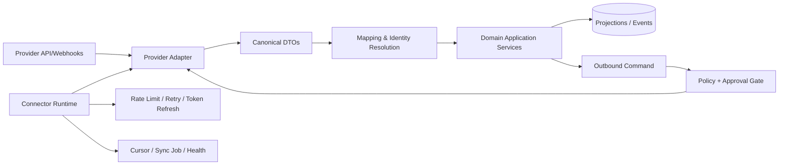
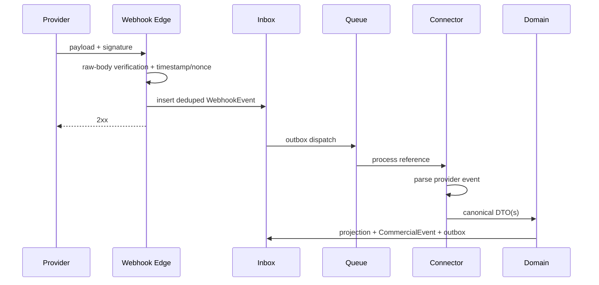

# Morubi — Arquitetura de Integrações

## 1. Princípios

- Integração é um bounded context; lógica de provider não vaza para regras de produto.
- CRM externo é system of record; Morubi mantém projeção, inteligência e ações autorizadas.
- Webhook reduz latência, sync incremental reconcilia lacunas e backfill cria baseline.
- Entrega é at-least-once: idempotência é obrigatória.
- Credenciais ficam em secrets manager; banco guarda apenas `secret_ref` e metadados.
- Toda conexão, mapping, cursor, evento e job pertence a uma organização.
- Capabilities são descobertas por conexão; ausência de uma feature não quebra o contrato comum.

### Boundary entregue na Fase 2

Esta fase implementa somente o lado canônico do boundary. Não há adapter de CRM, OAuth, webhook, backfill, fila, DLQ ou outbound. Entradas sintéticas chamam um serviço provider-agnostic com `SourceEnvelope` e um DTO normalizado.

A resolução segue estas regras:

1. chave forte: organização + provider + workspace externo + tipo + ID externo;
2. uma chave de evento imutável é preferida; sem ela, usa-se SHA-256 determinístico do payload;
3. duplicata retorna a entidade existente sem novo efeito;
4. uma nova versão grava outro `source_record`; versão antiga não regride a projeção;
5. contato sem identidade externa cria novo canônico; email e telefone não autorizam merge;
6. o mesmo ID externo em organizações diferentes é independente.

`connection_id` permanece opcional nos registros de origem/identidade para a conexão real futura. `external_workspace_id` mantém o namespace correto enquanto o provider piloto não foi escolhido.

## 2. Modelo de connector

```ts
interface Connector {
  readonly provider: string;
  readonly kind: 'crm' | 'calendar' | 'messaging' | 'meeting';

  getCapabilities(ctx: ConnectionContext): Promise<Capabilities>;
  validateConnection(ctx: ConnectionContext): Promise<ConnectionHealth>;
  refreshAuthorization(ctx: ConnectionContext): Promise<void>;

  listContacts(ctx: SyncContext, cursor?: Cursor): Promise<Page<ExternalContact>>;
  listDeals(ctx: SyncContext, cursor?: Cursor): Promise<Page<ExternalDeal>>;
  listActivities?(ctx: SyncContext, cursor?: Cursor): Promise<Page<ExternalActivity>>;
  listMessages?(ctx: SyncContext, cursor?: Cursor): Promise<Page<ExternalMessage>>;
  listCalls?(ctx: SyncContext, cursor?: Cursor): Promise<Page<ExternalCall>>;

  parseWebhook(ctx: WebhookContext): Promise<ProviderEvent[]>;
  verifyWebhook(request: RawWebhookRequest): Promise<VerificationResult>;

  upsertActivity?(ctx: WriteContext, input: ActivityWrite): Promise<WriteResult>;
  upsertNote?(ctx: WriteContext, input: NoteWrite): Promise<WriteResult>;
  updateDealFields?(ctx: WriteContext, input: DealFieldPatch): Promise<WriteResult>;
}
```

Interfaces por capacidade podem substituir um connector monolítico (`ContactReader`, `WebhookVerifier`, `DealWriter`). O contrato não deve fingir denominador comum inexistente; `Capabilities` informa recursos, escopos, limites e consistência.

Implementações futuras: `HubSpotConnector`, `PipedriveConnector`, `KommoConnector`, `SalesforceConnector`, além de adapters de calendário/mensageria/reunião.

## 3. Camadas



- **Adapter:** autenticação, endpoint, paginação, webhook e erros específicos.
- **Canonical DTO:** representação de transporte sem inferência comercial.
- **Mapping:** pipelines, stages, owners, custom fields e IDs.
- **Domain service:** upsert da projeção e criação de `CommercialEvent` quando aplicável.
- **Runtime:** retries, limits, tracing, locks e credential refresh.

## 4. Lifecycle da conexão

1. Admin autorizado inicia OAuth/credencial por fluxo seguro com `state`/PKCE quando suportado.
2. Callback valida state, resolve organização e grava token no secrets manager.
3. Connection recebe scopes/capabilities e executa health check.
4. Admin configura mapping mínimo e confirma escopo do backfill.
5. Webhooks são registrados; segredo de assinatura é armazenado fora do banco.
6. Backfill paginado roda com progresso, rate limit e capacidade de pausar.
7. Sync incremental e webhook passam a operar juntos.
8. Falha de auth marca `ACTION_REQUIRED` e notifica admin sem expor token.
9. Revogação desregistra webhooks quando possível, destrói secret e aplica política de dados.

## 5. Inbound webhook



Requisitos:

- validar assinatura sobre raw body antes de parsear;
- tolerância temporal e proteção contra replay;
- limite de tamanho, content type e rate limit por conexão/IP;
- resposta dentro do timeout do provider após aceitação durável;
- eventos desconhecidos são registrados/sanitizados e ignorados com métrica;
- evento sem conexão resolvível não cria tenant nem dado órfão;
- segredo/PII nunca aparece em erro ao provider.

## 6. Idempotência e ordenação

Prioridade de chave:

1. ID imutável do evento fornecido pelo provider;
2. ID do recurso + versão/revision;
3. fingerprint versionado de campos estáveis como fallback.

Unique: `(organization_id, connection_id, provider_event_id)`. Processamento mantém também uma execution key por handler/version.

Eventos podem chegar repetidos ou fora de ordem. Upsert compara `source_updated_at`/revision; evento antigo não regride projeção. Deletes usam tombstone. Se o provider não garante ordem, reconciliação busca a versão atual antes de efeitos destrutivos.

## 7. Sync, paginação e cursores

### Backfill

- Escopo configurado (pipelines, período, owners) e dry-run de estimativa quando possível.
- Page size adaptativo, checkpoint a cada página e job resumível.
- Não dispara cards/notificações live para histórico.
- Origina processamento de inteligência em fila de baixa prioridade e com budget.

### Incremental

- Preferir cursor/`updated_since`; aplicar overlap temporal pequeno para evitar boundary loss.
- Watermark só avança após persistência completa da página.
- Guardar cursor opaco sem interpretá-lo.
- Reconciliation periódico compara amostras/contagens e repara lacunas.

### Paginação

- Adapter converte cursor, offset ou next-link do provider para `Page<T>`.
- Detectar loop de cursor, página vazia com next token e limite total anômalo.
- Nunca carregar toda a coleção em memória.

## 8. Rate limits e retries

- Limiter por provider + conexão + endpoint, respeitando headers do provider.
- Token bucket/leaky bucket coordenado no Redis; concorrência global controlada.
- Backoff exponencial com jitter para `429`, `408` e `5xx` transitórios.
- Respeitar `Retry-After`.
- `4xx` semânticos não são repetidos cegamente; vão para erro acionável/DLQ.
- Circuit breaker reduz avalanche; prioridade para webhooks/updates interativos sobre backfill.
- Retry de escrita requer idempotency key ou read-after-write seguro.

## 9. OAuth e token refresh

- Tokens e client secrets apenas no secrets manager, cifrados e auditados.
- `secret_ref` no banco; acesso pelo runtime mínimo necessário.
- Refresh com lock por connection para evitar corrida; rotação atualiza secret atomicamente.
- Escopos mínimos e incremental authorization quando possível.
- Nunca logar authorization code, access/refresh token ou URL assinada.
- `invalid_grant` pausa sync, marca action required e notifica admin.
- Rotação/revogação deve invalidar cache e sessões dependentes.

## 10. Mapping e ownership

Mappings são versionados:

- external user ↔ membership/seller;
- pipeline/stage externo ↔ projeção;
- contact/deal/activity fields ↔ canonical fields;
- tipos de atividade/mensagem/call;
- status e motivos de perda;
- campos outbound allowlisted.

Cada campo tem ownership:

- `EXTERNAL`: CRM vence; Morubi não sobrescreve.
- `MORUBI`: inferência interna; não precisa existir no CRM.
- `HUMAN_APPROVED_SYNC`: Morubi sugere, humano/política aprova escrita.
- `SHARED_WITH_RESOLUTION`: somente se houver estratégia explícita de versão/conflito.

Mudança de mapping dispara reprocessamento controlado, não mutação invisível de histórico.

## 11. Outbound sync

Fluxo: domínio cria comando → Policy Engine verifica papel/allowlist/aprovação → outbox → connector → provider → read-after-write/webhook confirma.

Requisitos:

- idempotency key estável por intenção;
- patch de campos, não replace total;
- optimistic concurrency/ETag quando provider suporta;
- registrar before/after sanitizado, ator e resultado no audit log;
- estado `PENDING|SENT|CONFIRMED|FAILED|CONFLICT` visível;
- webhook de eco é correlacionado e não cria loop;
- falha parcial por campo é representada, não reportada como sucesso total.

## 12. Erros e observabilidade

Taxonomia comum:

- `AUTH_REQUIRED`, `INSUFFICIENT_SCOPE`
- `RATE_LIMITED`, `PROVIDER_UNAVAILABLE`
- `INVALID_MAPPING`, `VALIDATION_FAILED`
- `NOT_FOUND`, `CONFLICT`
- `PERMANENT_UNSUPPORTED`, `UNKNOWN`

Guardar mensagem sanitizada e provider request ID; resposta bruta sensível tem retenção/acesso restritos.

Métricas: webhook lag, dedupe rate, sync freshness, records/min, error por categoria, quota remaining, cursor age, reconnects e outbound confirmation latency.

## 13. Contract tests

Todo connector deve passar uma suíte comum:

- capabilities e health;
- auth/refresh e redaction;
- paginação/cursor/empty pages;
- webhook signature, replay e duplicata;
- canonical mapping com fixtures sanitizadas;
- evento fora de ordem/delete/update;
- rate limit/retry/circuit breaker;
- outbound idempotency e conflito;
- tenant isolation e revogação.

Fixtures são versionadas por API/provider. Sandbox do provider é usado em integração; replay local nunca contém credenciais reais.

## 14. Estratégia de rollout

1. Escolher um CRM piloto por demanda e qualidade de API/webhooks.
2. Implementar apenas contacts, deals, stages, users e atividades necessárias ao fluxo.
3. Rodar backfill em dry-run e shadow sync.
4. Validar contagens/amostras com design partner.
5. Habilitar leitura no produto; outbound permanece desligado.
6. Habilitar escrita por campo/organização com confirmação e kill switch.
7. Extrair aprendizados para a suíte comum antes do segundo provider.

## 15. OPEN QUESTIONS

1. CRM e canal piloto; versões de API e limites contratados.
2. Acesso oficial a WhatsApp será direto, via BSP ou somente pelo CRM?
3. Quais campos/atividades podem receber outbound no MVP?
4. Backfill histórico máximo e comportamento sobre contatos/deals deletados?
5. Como mapear múltiplos pipelines/unidades na mesma organização?
6. Quem resolve conflito de identidade/owner e em qual UI?

## 16. Estado implementado do connector framework (2026-10-06)

### Provider piloto

`PILOT_CRM_PROVIDER` continua com o placeholder `<CRM_ESCOLHIDO>`. Nenhum provider real foi selecionado. Consequentemente:

- não há adapter externo, SDK, endpoint ou payload presumido;
- não há OAuth, scopes reais, refresh ou revogação fictícios;
- não há webhook genérico nem alegação de verificação de assinatura;
- não há polling de produção ou outbound;
- a pendência detalhada está em `docs/integrations/PROVIDER_SELECTION_PENDING.md`.

### Contrato entregue

`@morubi/integrations` expõe `CRMConnector` read-only com account/health, contacts, deals, lookup opcional, pipelines/stages opcionais e capabilities explícitas. Paginação recebe e devolve cursor opaco. O core não conhece offset, `after`, página ou `nextLink`.

Provider DTOs permanecem no diretório do adapter e são mapeados para:

- `NormalizedContactRecord` (`SourceEnvelope` + `CanonicalContactInput`);
- `NormalizedDealRecord` (`SourceEnvelope` + input canônico + IDs externos relacionados).

Não existem métodos de escrita no contrato. Owners externos são metadata de transporte e não criam `User` ou `Membership`.

### Runtime de sync

`CRMSyncService` consome um connector registrado, pagina contacts e deals e usa exclusivamente `CommercialIngestionService`. Cada `SourceEnvelope` recebe `connectionId` e `syncJobId`, preservando idempotência, provenance e ordering da Fase 2.

O watermark incremental usa overlap inclusivo (`>=`) e depende da deduplicação canônica. O checkpoint avança depois da página completa. Se um registro falhar, os demais da página podem persistir, o job termina `PARTIAL` e o cursor daquela página não avança; um replay seguro deduplica o que já foi aceito.

Erros `429`, `408` e `5xx` são retryable com backoff exponencial, jitter e `Retry-After`; auth, scope e payload inválido não são repetidos cegamente. Erros públicos são sanitizados e tokens são redigidos por chave.

### Fixture e contract suite

`FixtureCRMConnector` simula 100 contatos por padrão, deals relacionados, paginação, incremental, duplicata, updates fora de ordem, archive, `429` e `500`. A contract suite comum valida capabilities, account health, paginação opaca, unicidade externa, timestamps, normalização e features opcionais.

Fixture não é provider piloto, não é registrada no runtime de produção e não aparece como opção conectável na UI.

### Execução assíncrona

PostgreSQL guarda a fila lógica e o tracking em `sync_jobs`: solicitar um job e executá-lo são operações separadas. Um worker e Redis/BullMQ serão introduzidos somente com provider real e requisitos de carga/recovery conhecidos. Até lá, a API não publica mutação de sync; isso evita criar um endpoint `202` sem executor durável.

## Realtime interno do Copilot (Fase 5)

SSE é integração interna API→desktop, não conector CRM. Sessão vai em cookie/header no Electron main; token em query string é proibido. `Last-Event-ID` suporta replay da outbox, heartbeat mantém intermediários ativos e o cliente usa backoff exponencial. Envelopes incompatíveis não atravessam o preload.

O simulador de `/app/dev/conversations` é infraestrutura sintética/admin-only, não provider conectável. Ele não muda a Fase 3B: CRM piloto, OAuth, scopes, limites e webhooks continuam pendentes.
