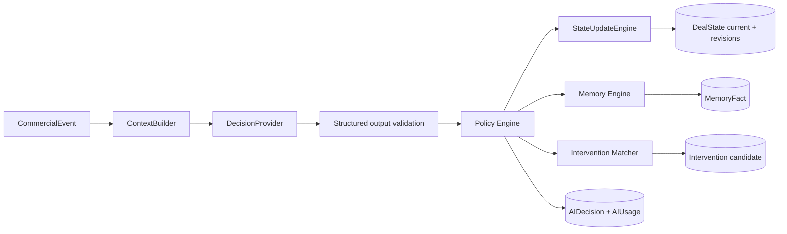

# Morubi — Intelligence Engine v1

**Status:** Fase 4 implementada em shadow mode com provider determinístico de fixture.  
**Provider externo:** JEV real não integrado; não existe documentação, SDK, endpoint ou credencial verificável no repositório.

## 1. Boundary e fluxo

O motor consome somente o modelo canônico. `Message` continua sendo registro bruto normalizado; `CommercialEvent`, fato comercial imutável; `MemoryFact`, fato durável selecionado; e `DealState`, projeção atual inferida. Nenhuma dessas estruturas substitui outra.

## 2. DealState e revisões

`deal_states` mantém exatamente um snapshot atual por `(organization_id, deal_id)`. `deal_state_revisions` mantém cada versão que efetivamente alterou o estado. Todo campo inferido é um envelope com `value`, `confidence`, `sourceEventIds` e `updatedAt`.

O `StateUpdateEngine` aceita somente campos allowlisted e operações `SET`, `ADD`, `REMOVE` e `RESOLVE`. Campos escalares aceitam `SET`; campos de coleção aceitam deltas. Um lock transacional por tenant/deal serializa revisões. Cada revisão aponta para o evento e a decisão que a causaram.

`canonicalStatus` e `stage` são inicializados da projeção externa quando o primeiro delta é aplicado; continuam distintos de sinais inferidos. Contradições geram nova revisão e nunca alteram uma revisão anterior.

## 3. Memória

`memory_facts` prioriza `DEAL_FACT` e `CONTACT_FACT`, mantendo os tipos futuros `SELLER_PATTERN`, `COMPANY_PATTERN` e `PLAYBOOK_REFERENCE`. O valor tem fingerprint, confiança, eventos-fonte, decisão, validade, status e eventual fato supersedido.

O limiar de memória é independente do limiar de estado. Valor idêntico ativo não é duplicado. Novo valor para o mesmo tipo de fato marca o anterior como `SUPERSEDED`, cria uma linha `ACTIVE` e preserva o vínculo `supersedes_id`. Triggers verificam que escopos de deal/contact pertencem ao tenant.

## 4. Context Builder e retrieval

`ContextRetriever` isola acesso a dados do motor. A implementação PostgreSQL oferece estado atual, eventos recentes, memória relevante, mensagens históricas, última decisão e snippets mínimos do catálogo.

Budget padrão:

- 1 evento atual obrigatório;
- até 8 eventos recentes;
- até 12 fatos de memória;
- até 12 mensagens, somente após pedido explícito de histórico;
- até 4 snippets;
- até 12.000 caracteres de conteúdo textual no bundle.

Não há banco vetorial. Retrieval é textual e tenant-scoped no PostgreSQL. O provider pode pedir histórico; o processador reconstrói o contexto uma vez com mensagens limitadas e reavalia.

## 5. DecisionProvider

`DecisionProvider` publica apenas `metadata` versionada e `decide(DecisionInput)`. A saída Zod inclui classificação, objeção, buying signal, risco, mudança de sentimento, estratégia, necessidade de histórico, deltas de estado/memória e confiança.

`FixtureDecisionProvider` é determinístico, sem rede e exclusivo de desenvolvimento/testes. Ele permite contract tests e evals reproduzíveis. `JEV_ENABLED=false` permanece obrigatório: o adapter real só poderá existir depois de documentação e credenciais reais; nenhuma API JEV foi presumida.

## 6. Policy Engine

O provider recomenda; policy governa. Os thresholds padrão são configuração, não constantes universais de produto:

| Categoria     | Limiar v1 |
| ------------- | --------: |
| objection     |      0,70 |
| risk          |      0,75 |
| buying signal |      0,70 |
| intervention  |      0,65 |
| state update  |      0,65 |
| memory update |      0,80 |

Resultados persistidos: `ALLOW`, `SUPPRESS`, `ESCALATE`, `SHADOW` e `REQUIRE_MORE_CONTEXT`. Na configuração inicial, `SHADOW_MODE=true` e `INTERVENTIONS_VISIBLE=false`: decisões e candidatas são persistidas, mas nada chega ao seller.

## 7. Intervention Library

O catálogo inicial traz dez templates globais revisáveis. Templates tenant-owned podem coexistir. Matching filtra por estratégia/status e sempre prioriza a versão mais nova da organização sobre a global. Ausência de template produz `GENERATION_REQUIRED`; não existe chamada a DeepSeek ou outro gerador.

RLS permite ao runtime ler globals e o próprio tenant, mas só mutar templates do próprio tenant. Um trigger impede candidata de referenciar template de outra organização.

## 8. Processamento, idempotência e reprocessing

`IntelligenceProcessor` permanece puro em relação a HTTP. Na Fase 5, `intelligence_jobs` substitui o dispatcher inline no caminho demonstrável: claim tenant-scoped com `SKIP LOCKED`, tentativas limitadas e backoff. O request apenas ingere/enfileira.

A chave combina `eventId`, versões de decisão/contexto/policy, provider, modelo, versão do modelo e configuração. O commit usa advisory lock, unique constraint e transação única para decisão, usage, revisão, memória e candidata. Repetir a mesma chave não cria efeito novo. Uma nova versão produz execução independente e permite comparação/reprocessamento.

## 9. Observabilidade e conteúdo sensível

`ai_decisions` guarda output estruturado e metadados, nunca prompt bruto. `ai_usage` registra provider, modelo, sucesso/falha, retry, tamanhos, latência e custo estimado. O sink de métricas cobre eventos processados, erros, baixa confiança, matching/generation, updates de estado/memória e tempos de contexto/decisão/policy. Atributos contêm somente organization/provider/model, sem texto.

## 10. Feature flags e UI interna

- `INTELLIGENCE_ENABLED`: `true` por padrão em dev/test e `false` em production quando omitida;
- `JEV_ENABLED`: `false`;
- `SHADOW_MODE`: `true`;
- `INTERVENTIONS_VISIBLE`: `false`;
- `INTELLIGENCE_DEV_UI`: gate adicional do endpoint interno em production;
- `NEXT_PUBLIC_INTELLIGENCE_DEV_UI`: exibe a navegação interna no web.

`/app/dev/intelligence` é visível somente a OWNER/ADMIN quando a flag pública está ativa. A API também exige `intelligence.dev.read`; esconder navegação não é o controle de segurança.

## 11. Corpus e avaliação offline

O corpus versionado possui 55 cenários multi-turn e 110 eventos sintéticos: preço, timing, concorrente, autoridade, necessidade, confiança, implementação, buying signals, rejeição, avanço e mensagens neutras. Cada cenário tem labels de classificação, objeção e estratégia.

Baseline da fixture v1 em 2026-10-06:

- classification accuracy: **92,73%**;
- objection accuracy: **96,36%**;
- strategy accuracy: **96,36%**;
- FPR: 0% para objection/rejection/next-step e 4% para buying-signal/information no corpus atual;
- calibration 0,60–0,74: 7 exemplos, confiança média 0,72, accuracy 71,43%;
- calibration 0,85–0,94: 48 exemplos, confiança média 0,9006, accuracy 95,83%.

Esses números validam somente a fixture e o harness, não qualidade de um modelo real. Metas de produção ainda precisam de dataset autorizado, revisão humana e thresholds aprovados.

## 12. Entrega na Fase 5

`CopilotRepository` transforma somente candidatas elegíveis em delivery, aplica prioridade, cooldown, dedupe, janela e expiração e publica outbox realtime. `InterventionFeedback` permanece separado. O harness registra intervenção esperada/detectada e elegibilidade visible, com export JSON/CSV. Detalhes de UX, SSE e segurança estão em `CRM_COPILOT.md`.

## 13. Limites deliberados

Sem JEV real, CRM real, embeddings/vector DB, DeepSeek, Gemini, áudio, call live, geração livre, score final, Coach, Manager Analytics ou outbound. Cards do seller existem apenas para templates e permanecem shadow por default.
