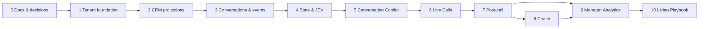

# Morubi — Roadmap Técnico

Roadmap sequencial por redução de risco. Fases não são datas; cada uma termina por evidência e critérios, não por volume de código. Features ficam atrás de flags por organização.

## Princípios de execução

- Um CRM e poucos design partners antes de generalizar connectors.
- Fluxos verticais pequenos com observabilidade, segurança e feedback desde o início.
- Shadow mode antes de recomendações; recomendações antes de automação externa.
- Offline/backfill antes de real-time; post-call antes de live call quando isso reduzir risco.
- Toda fase inclui testes de tenant, audit, uso/custo e documentação afetada.
- Nenhuma fase transforma Morubi em CRM.

## PHASE 0 — Fonte de verdade e validação de fundação

**Objetivo:** alinhar produto, arquitetura e decisões irreversíveis antes do bootstrap.

**Entregáveis**

- Documentos desta pasta revisados por produto, engenharia, segurança e founder.
- Respostas mínimas: CRM piloto, cloud/região, auth, JEV, providers, consentimento e retenção.
- ADRs para escolhas confirmadas; orçamento/SLO/volumes iniciais.
- Spike descartável de ORM/RLS, filas e provider de IA/STT quando necessário.
- Golden dataset sintético/sanitizado inicial e taxonomia de intervenções.

**Dependências:** acesso aos stakeholders e design partners.

**Riscos:** decidir stack sem volume/requisitos; documentação virar verdade não revisada.

**Conclusão:** decisões bloqueantes aprovadas, open questions com owner/data e nenhuma contradição crítica entre specs.

## PHASE 1 — Auth, organizations, roles e app shell

**Objetivo:** criar o boundary seguro sobre o qual todo dado futuro será construído.

**Entregáveis**

- Monorepo pnpm/Turborepo, CI, ambientes e logging estruturado básico.
- Auth, `Organization`, `User`, `Membership`, `Team`, papéis e permission matrix.
- Tenant-scoped repositories e RLS/defesa escolhida.
- Shell Electron desktop-first para seller e shell Next.js para manager/admin, ambos com rotas autorizadas.
- Audit log mínimo, secrets manager, feature flags e testes cross-tenant.
- Health/readiness, migrations process e backup baseline.

**Dependências:** decisões de auth, cloud, ORM e região.

**Riscos:** IDOR, pool/RLS mal configurado, papel ADMIN amplo demais.

**Conclusão:** testes provam isolamento A/B em API/DB; seller/manager/admin veem apenas navegação autorizada; revogação encerra acesso; deploy e rollback funcionam.

## PHASE 2 — Contacts, deals e abstração CRM

**Objetivo:** importar contexto comercial útil sem criar pipeline autoritativo.

**Entregáveis**

- Connector contracts/capabilities e adapter do CRM piloto.
- OAuth/secrets, webhook inbox, sync/backfill, cursors, retries e DLQ.
- Projeções de contacts, deals, stages, owners e external records.
- Telas read-mostly de Contatos/Oportunidades com provenance/freshness e link ao CRM.
- Mapping UI mínima e health de conexão.

**Dependências:** Phase 1; CRM/design partner e sandbox.

**Riscos:** limites/API instáveis, duplicação de contato, conflitos de ownership.

**Conclusão:** backfill e incremental reconciliam amostra acordada; duplicatas não duplicam dados; provider outage recupera; outbound continua off por padrão.

## PHASE 3 — Ingestão de conversas e `CommercialEvent`

**Objetivo:** transformar interações do primeiro canal em timeline canônica confiável.

**Entregáveis**

- Conversations, participants, messages/media e `CommercialEvent` v1.
- Normalizer e identity/deal resolution com quarentena.
- Event Aggregator configurável e replay.
- Timeline de Conversas, raw-versus-derived claro.
- Retenção/deleção da fonte e telemetria de ingestão.

**Dependências:** projeções/connector; canal piloto e política de PII.

**Riscos:** ordem/edição de mensagens, actor mapping incorreto, payload sensível em logs.

**Conclusão:** corpus de replay normaliza/deduplica corretamente; exemplo fragmentado agrega em um bloco; exclusão propaga; eventos ambíguos não contaminam deal errado.

## PHASE 4 — Deal State e JEV Decision Engine

**Objetivo:** provar inteligência incremental e decisão estruturada sem UI intrusiva.

**Entregáveis**

- Hot Context, `DealState` versionado e MemoryFact básico.
- JEV contract, Policy Engine, scorecards v1 e Intervention Library inicial.
- AIExecution/AI calls/usage ledger, budgets e kill switches.
- Evals offline e execução em shadow mode.
- Playbook mínimo versionado ligado às decisões.

**Dependências:** Phase 3; taxonomia/golden dataset; definição de JEV/providers.

**Riscos:** baixa precisão, estado contraditório, custo ou falso senso de certeza.

**Conclusão:** metas aprovadas de precisão/recall, schema validity, p95 e custo; nenhum cross-tenant retrieval; patches reproduzíveis; false-card rate aceitável em shadow.

## PHASE 5 — Conversation Copilot

**Objetivo:** entregar valor direto ao seller em conversas quase em tempo real.

**Entregáveis**

- Cards via SSE, cooldown/TTL/dedupe e fallback de polling.
- Templates para poucos casos de alto valor; geração somente quando justificada.
- Feedback útil/incorreto/dispensado e evidências explicáveis.
- Home mínima: follow-ups, riscos e próximas ações derivados.
- Tasks sugeridas; outbound write pilotado somente com confirmação.

**Dependências:** qualidade da Phase 4 e UX com sellers.

**Riscos:** fadiga de alertas, recomendação tardia, write indesejado.

**Conclusão:** latência p95 e aceitação atingem alvo do piloto; seller controla cards; falso positivo/volume estão dentro do limite; sync é auditável/reversível quando possível.

## PHASE 6 — Generative Intelligence

**Objetivo:** comunicar decisões estruturadas com personalização segura quando a biblioteca não possui template adequado, sem transferir estratégia ou policy para o modelo generativo.

**Entregáveis concluídos em 2026-10-07**

- `GenerativeProvider`, fixture determinística e adapter DeepSeek isolados em `@morubi/ai`.
- Perfis lógicos `FAST_GENERATION` e `DEEP_REASONING`, router, prompt versionado e output Zod.
- Sanitização, budgets de contexto/output, regras comerciais/organizacionais e validator de playbook.
- Retry de validação limitado, timeout, circuit breaker, dedupe por generation key e supressão segura.
- `apps/worker` dedicado para intelligence/generation jobs com `SKIP LOCKED`, backoff, recovery e graceful shutdown.
- `generation_jobs`, `generative_executions`, `ai_usage` dimensional, RLS e migration `0006`.
- Staleness antes/depois da geração e delivery somente após toda a policy existente.
- Corpus sintético de 56 casos, checks determinísticos e export JSON/CSV para revisão humana.

**Gates:** PostgreSQL 17/CI continua sendo a validação autoritativa de migration, RLS e integração; egress DeepSeek real permanece opt-in e exige configuração deliberada de chave, preço e budgets.

**Conclusão:** template-first não chama provider; geração válida pode alimentar a candidata e a delivery existente; output inválido, inseguro, caro, falho ou obsoleto nunca chega ao seller. Detalhes em `GENERATIVE_INTELLIGENCE.md`.

## PHASE 7 — Inteligência pós-call

**Objetivo:** converter transcript final em registro confiável e ação.

**Entregáveis**

- Transcript final, summary, next steps, campos extraídos e evidências.
- CallScore/DealScore versionados e explicáveis.
- Tasks e CRM writeback com review/approval.
- Reconciliation entre live partial e final.
- Retenção, export e deleção end-to-end de mídia/derivados.

**Dependências:** calls/media; scorecards/playbook aprovados.

**Riscos:** resumo incorreto escrito no CRM, leakage de gravação, score enviesado.

**Conclusão:** qualidade avaliada em corpus real autorizado; correções humanas medidas; writeback idempotente; delete/export comprovados; score exibe fatores/confiança.

## PHASE 8 — Coach

**Objetivo:** transformar gaps observados em prática e feedback individual.

**Entregáveis**

- Competency model/rubrics; scenario, session e evaluation.
- Roleplay com personas sintéticas/sanitizadas e dificuldade configurável.
- Histórico/evolução e separação entre treino privado e avaliação formal.
- Guardrails de people analytics e acesso gerencial.

**Dependências:** volume/qualidade de calls, playbook e política de pessoas.

**Riscos:** vigilância percebida, avaliação injusta, cenário com PII real.

**Conclusão:** vendedor entende uso/visibilidade; rubrics têm concordância humana; cenário não expõe PII; evolução é comparável por versão.

## PHASE 9 — Manager Analytics

**Objetivo:** explicar padrões operacionais com evidência acionável.

**Entregáveis**

- SellerMetric, coortes e pipeline de agregação reproduzível.
- ManagerInsight narrativo com amostra, período, confiança e drill-down.
- Áreas: calls, objeções, perdas, conversão, adherence, evolução e coaching.
- Suppressão de grupos pequenos e distinção correlação/causalidade.

**Dependências:** outcomes CRM confiáveis, volume suficiente e team scopes.

**Riscos:** causalidade falsa, ranking nocivo, leakage entre equipes.

**Conclusão:** cada diagnóstico é reproduzível e evidenciado; métricas reconciliam com fonte; RBAC e small-sample rules passam testes; managers validam ação gerada.

## PHASE 10 — Living Playbook

**Objetivo:** fechar o loop de aprendizagem sem retirar controle humano.

**Entregáveis**

- Detecção de padrões e propostas de alteração com evidências/impacto esperado.
- Workflow draft → review → approval → publish → rollback.
- Experimentos/version comparison e histórico de adoção.
- Proibição técnica de auto-publicação por IA.

**Dependências:** analytics confiável, governança e volume longitudinal.

**Riscos:** overfitting ao passado, mudança baseada em correlação, fragmentação de versões.

**Conclusão:** proposta mostra amostra/evidência; aprovação humana é obrigatória e auditada; versão publicada é imutável/rollbackável; impacto pode ser medido.

## Sequenciamento visual

Phase 7 pode preceder parte da Phase 6 se importação de gravações pós-call for tecnicamente mais simples; isso é recomendável para validar STT, summaries e consentimento antes do streaming live.

## Primeira implementação recomendada

Após aprovação da Phase 0, implementar **um vertical slice de fundação da Phase 1**, e nada de IA ainda:

1. bootstrap do monorepo e CI;
2. autenticação;
3. `Organization`, `User`, `Membership` e quatro roles;
4. um repository tenant-scoped + RLS/defesa escolhida;
5. app shell com rotas vazias condicionadas por permissão;
6. audit de login/membership;
7. teste automatizado negativo provando que Organização A não acessa recurso de B.

O slice termina com duas organizações seedadas em ambiente de teste e uma prova E2E de isolamento. Essa é a menor implementação que reduz o maior risco sistêmico e prepara todas as demais fases sem fingir valor de IA antes de haver dados confiáveis.

## Decisões que bloqueiam início

- Auth provider e política MFA.
- Cloud, região e serviços gerenciados.
- ORM após spike curto.
- CRM/design partner piloto.
- Definição real de JEV e providers (bloqueia Phase 4, não Phase 1).
- Retenção/consentimento (bloqueia mídia/calls, não shell básico).

## Nota de execução — milestone “Fase 3 CRM Connector Framework” (2026-10-06)

O briefing de execução posterior nomeou o connector CRM como Fase 3, enquanto este roadmap original o agrupava na Fase 2 e reservava Fase 3 para conversations/events. Para não reescrever o histórico, a numeração original permanece e esta nota registra o milestone efetivamente executado.

Entregue:

- abstraction/capabilities read-only e separação entre DTO do provider e input canônico;
- fixture connector e contract suite sem dependência externa;
- `crm_connections`, `sync_jobs`, checkpoints, RLS e proteção contra job concorrente;
- executor inicial/incremental sobre o `CommercialIngestionService`;
- retry/rate-limit classification, redaction e partial replay seguro;
- API/UI web read-only de status com bloqueio explícito de provider;
- testes unitários e suíte PostgreSQL preparados para CI.

Bloqueado pela decisão ainda aberta de CRM piloto:

- adapter e API client reais;
- OAuth, scopes, refresh e revogação;
- webhooks/assinatura/replay e reconciliation específico;
- worker/queue operacional e agendamento de polling;
- botões Conectar, Sincronizar agora e Desconectar na UI.

Próximo gate: escolher CRM/design partner, versão de API e modalidade de auth. Depois, completar os itens bloqueados deste milestone antes de avançar para a Fase 4 solicitada. A fase de IA continua proibida até esse gate.

## Nota de execução — Fase 4 Intelligence Engine (2026-10-06)

Um briefing posterior autorizou explicitamente a Fase 4 sem CRM real, usando somente fixtures e eventos sintéticos. Isso substitui o último gate da nota anterior para o núcleo offline, mas não autoriza provider externo nem Fase 5.

Entregue: DealState/revisões, MemoryFact, Context Builder com budget, DecisionProvider + fixture, Policy Engine/thresholds, catálogo/override de intervenções, processing key versionada, shadow persistence, AIUsage, RLS, APIs read-only, UI admin/dev e corpus offline de 55 cenários/110 eventos.

Bloqueado antes de produção: contrato JEV, dataset autorizado/revisão humana, metas aprovadas, worker durável, observabilidade exportada, budgets reais e teste PostgreSQL em ambiente com serviço disponível. Próximo gate recomendado é validar a qualidade da Fase 4; só então planejar Fase 5 sem habilitar cards por padrão.

## Nota de execução — Fase 5 CRM Copilot em texto + realtime (2026-10-06)

Entregue: fila PostgreSQL assíncrona, delivery policy com fadiga/prioridade/expiração, lifecycle e feedback, outbox + SSE replayável, bridge Electron segura, Conversas em três colunas, painel contextual/copilot, laboratório admin de fixtures, telemetria/false-card rate e escopo próprio do seller por owner do deal. Shadow permanece default.

Fase 3B continua pendente: provider CRM, OAuth, scopes e webhooks reais não foram simulados. Antes de produção também faltam validar o worker multi-instância em ambiente implantado, vínculo manager-equipe, teste de carga do SSE, metas humanas de false-card rate e ativação deliberada das flags. A Fase 6 foi concluída em modo seguro e opt-in; seus gates externos estão documentados abaixo.

## Nota de execução — Fase 6 Generative Intelligence (2026-10-07)

A geração foi adicionada depois da decisão/policy/library, nunca como substituta. O processo dedicado `apps/worker` consome jobs PostgreSQL tenant-safe; `@morubi/ai` isola providers, router, prompt, sanitização, validação e custo. DeepSeek e geração ficam desligados por default. O corpus de 56 casos é determinístico e o CI executa seu harness sem egress.

O gate PostgreSQL externo permanece explícito para a migration `0006`, RLS, cross-tenant, duplicate job e fluxo integrado.

## Nota de execução — Fase 7 Audio Intelligence (2026-10-07)

Entregue: `AudioAsset`, object storage local isolado, fetcher externo com SSRF defense, fixture/Gemini transcription, fila no worker existente, transcript versionado, promoção canônica para `CommercialEvent`, ordering sem regressão de estado, usage/custo, retenção, player desktop e simulador de cinco cenários. Os dois gates de áudio ficam desligados por default.

O gate PostgreSQL externo permanece para `0007`, RLS, concorrência/idempotência e E2E até delivery. Fase 3B continua adiada. Fase 8 recomendada: projetar calls/reuniões somente após consentimento, contratos de captura, metas de latência/qualidade, diarização e avaliação do piloto assíncrono; nenhuma captura live foi implementada aqui.

## Nota de execução — Fase 8 Live Calls desktop (2026-10-07)

Entregue: sessão canônica, lifecycle/heartbeat, consentimento, adapters de detecção Meet/Zoom, abstrações de captura e STT realtime, fixture determinística, partial/final, agregação, memória/fases, promoção para `CommercialEvent`, job prioritário no engine existente, cards live/staleness/TTL, área Calls, modo compacto, usage/custo, migration `0008`, RLS, testes unitários/integrados condicionais e carga sintética 10/25/50. Todos os gates ficam desligados.

Limites explícitos: não há provider STT realtime contratado, captura de áudio do sistema, observador real de janelas/processos nem validação do adapter de microfone em máquinas Windows/macOS. PostgreSQL externo continua sendo gate para migration/RLS/E2E. Fase 3B permanece adiada. Próximo passo recomendado é validar a Fase 8 em piloto controlado; a Fase 9 não foi iniciada.
