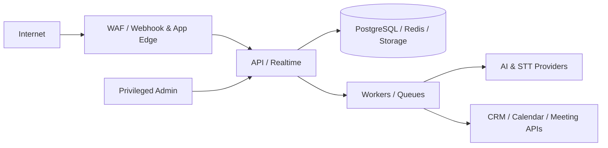

# Morubi — Segurança, Privacidade e Threat Model

**Postura:** security/privacy by design, sem alegar certificação ou compliance ainda não auditados.  
**Dados de maior risco:** conversas, voz, gravações, transcripts, PII, dados comerciais, tokens de integração e inferências sobre pessoas.

## 1. Objetivos de segurança

- Confidencialidade entre organizações e dentro dos escopos de equipe.
- Integridade de eventos, estado, playbook, scores e writes externos.
- Disponibilidade do fluxo de ingestão/copilot com degradação segura.
- Auditabilidade de ações administrativas, acesso sensível e execuções de IA.
- Minimização, retenção e exclusão verificáveis.
- Transparência/controle humano sobre gravação, inferência e decisões relevantes.

## 2. Trust boundaries e ameaças

| Ameaça                   | Exemplo                        | Controles principais                                                     |
| ------------------------ | ------------------------------ | ------------------------------------------------------------------------ |
| Cross-tenant access      | IDOR em deal/call/search       | tenant context confiável, RBAC/ABAC, RLS, testes negativos               |
| Privilege escalation     | seller consulta equipe         | membership/team scope em toda query e realtime                           |
| Credential theft         | token OAuth em log/DB          | secrets manager, redaction, scopes mínimos, rotação                      |
| Webhook spoof/replay     | evento falso de CRM            | assinatura raw-body, timestamp/nonce, dedupe, allowlist quando útil      |
| Prompt injection         | mensagem manda “ignore regras” | tratar conteúdo como dado, policy fora do modelo, output validation      |
| Data exfiltration via AI | prompt contém outra org        | retrieval tenant-first, egress policy, provider contracts, DLP/redaction |
| Malicious media/upload   | arquivo ativo ou gigante       | signed upload, type/size/hash scan, isolated processing                  |
| Insider misuse           | escuta de gravação sem motivo  | least privilege, audit, just-in-time support access                      |
| Queue/replay abuse       | job duplicado cria writes      | signed/internal identity, idempotency, version checks                    |
| Denial/cost abuse        | call/LLM ilimitado             | rate limit, quotas, budgets, circuit breaker, kill switch                |
| Supply chain             | package comprometido           | lockfile, review, scanning, SBOM, updates controlados                    |
| Accidental retention     | backup mantém PII indefinida   | lifecycle, crypto-erasure design, restore procedures                     |

## 3. Tenant isolation

### Aplicação

- Resolver organização a partir de sessão/membership ou conexão verificada.
- `organization_id` enviado pelo cliente é filtro solicitado, não autoridade.
- Application services recebem `TenantContext`; repositories tenant-owned não têm método sem contexto.
- Verificar recursos relacionados com FK/constraint tenant-consistente.
- Cache keys, rate limits, filas, storage prefixes, search/vector filters e telemetry carregam tenant.

### Banco

- `organization_id NOT NULL`, índices tenant-first e uniques compostos.
- RLS como defesa em profundidade; `SET LOCAL` dentro da transação e pool testado contra vazamento de sessão.
- Conta de runtime sem bypass RLS; migrations/admin usam credencial separada e auditada.
- As tabelas `users`, `accounts`, `sessions` e `verifications` usam RLS habilitada e forçada. Somente `morubi_auth` recebe `SELECT/INSERT/UPDATE/DELETE` e policies integrais nessas quatro tabelas; essa role backend é `NOSUPERUSER`, `NOBYPASSRLS`, `NOCREATEDB`, `NOCREATEROLE` e `NOINHERIT`. `morubi_app` não possui privilégios nelas e `morubi_auth` não possui privilégios nas tabelas comerciais.
- Views/materialized views preservam tenant; função `SECURITY DEFINER` é exceção revisada.

### Testes obrigatórios

- Para cada endpoint/repository/job/realtime channel: tenant A não lê, altera, infere, busca nem recebe evento de B.
- Fuzz de IDs válidos de outro tenant.
- Testes de cache, embeddings, exports, URLs assinadas e audit/support tooling.

## 4. Autenticação e sessão

- Preferir provedor OIDC/OAuth maduro; MFA obrigatório para owner/admin e recomendado para todos.
- Cookies `HttpOnly`, `Secure`, `SameSite`; proteção CSRF para mutações baseadas em cookie.
- POSTs do Better Auth exigem uma origem da allowlist exata. Ausência ou origem não confiável falha com 403; CORS wildcard e desativação de CSRF são proibidos.
- Sessões curtas com rotação/revogação; device/session list quando viável.
- Convite com token single-use, prazo curto e vínculo à organização/email.
- SSO/SAML e SCIM são NEXT/LATER conforme enterprise, sem bloquear RBAC correto no MVP.
- Step-up auth para export/delete, troca de owner, secrets e políticas sensíveis.

## 5. Autorização

Modelo inicial:

| Papel   | Escopo esperado                                                                           |
| ------- | ----------------------------------------------------------------------------------------- |
| SELLER  | próprios deals/calls e contatos relacionados; coach permitido                             |
| MANAGER | equipes atribuídas, suas calls/deals e análises agregadas                                 |
| ADMIN   | membros, integrações, playbook e configuração; conteúdo sensível conforme policy separada |
| OWNER   | administração total, billing/políticas e ações destrutivas com step-up                    |

- Default deny; endpoint verifica ação + recurso + escopo de equipe.
- Admin não recebe automaticamente acesso irrestrito a toda gravação se isso não for necessário.
- Mudança de papel revoga sessões/realtime/caches afetados.
- Ação automática usa service principal com permissions menores que admin.
- Support interno usa acesso just-in-time, motivo, aprovação quando aplicável e audit log.

## 6. Secrets e integrações

- Tokens, client secrets, webhook secrets e chaves ficam em secrets manager, nunca em código, prompt, banco de aplicação ou log.
- `integration_connections.secret_ref` é opaco.
- IAM/service identities por workload/ambiente, sem chaves long-lived quando a cloud permitir.
- OAuth com state/PKCE, redirect URI estrita e scopes mínimos.
- Refresh sob lock e rotação; revogação remove secret e acesso dependente.
- CI não imprime secret; scanner de segredo pre-commit/CI e procedimento de incidente.

## 7. Criptografia e rede

- TLS moderno em trânsito, inclusive banco/cache/filas/providers.
- Criptografia at rest gerenciada para volumes, banco, backups e objects.
- Envelope encryption/chave por classe ou tenant para gravações/transcripts de maior sensibilidade, se suportado pelo threat model.
- KMS com rotação, IAM mínimo e logs de uso; chaves separadas por ambiente.
- Private networking para data services quando disponível; egress allowlist para providers.
- URLs assinadas curtas e vinculadas a objetos autorizados; não persistir URL assinada.

## 8. Dados sensíveis, gravações e consentimento

- Classificar: identificadores, contato, conteúdo, áudio, transcript, inferência, credencial e telemetria.
- Coletar somente conteúdo necessário; separar metadata operacional de conteúdo.
- Consentimento/política registra base, momento, participantes/canal, jurisdição quando aplicável e versão do aviso.
- UI mostra estado de gravação; sem consentimento/política válida, não capturar ou interromper conforme regra definida.
- Recording access é uma permissão distinta e auditada.
- Downloads usam watermark/expiração quando útil; compartilhamento público é proibido por padrão.
- Conteúdo real não deve ser copiado para dev/test; usar fixtures sintéticas/sanitizadas.

## 9. Segurança de IA

- Conteúdo de CRM/conversa/transcript é input não confiável, nunca instrução de sistema.
- Prompt templates e tools são versionados; tool calls têm allowlist e validação.
- Modelo não decide autorização, consentimento, quota ou write externo.
- Retrieval aplica tenant/ACL antes de ranking; resposta mantém evidence refs.
- Output estruturado passa por schema e policy; texto é escapado na UI.
- Providers são avaliados por retenção, treinamento sobre dados, região, subprocessadores e segurança contratual.
- Desabilitar training/retention do provider quando possível; não afirmar zero retention sem contrato/configuração verificados.
- Redação/minimização antes do provider quando a tarefa não exige PII.
- Prompt/output logging é opt-in operacional, cifrado, restrito e com retenção curta.
- Evals incluem injection, cross-tenant leakage, hallucination, toxicidade e inferências sensíveis.

## 10. Webhook e API security

- Validar assinatura usando raw body e comparação constant-time.
- Timestamp/nonce + janela de replay; dedupe durável.
- Rate limit por IP, usuário, organização, conexão e tipo de operação.
- Limites de body, profundidade JSON, campos e arquivos.
- Zod/schema validation e content types estritos.
- CORS allowlist; CSP, HSTS, frame protections e secure headers no web.
- Idempotency key para comandos; optimistic concurrency para updates.
- Erros não expõem existência cross-tenant, SQL, stack, prompt ou provider secret.
- APIs internas autenticadas por workload identity/mTLS conforme ambiente.

### Electron

- `contextIsolation: true`, `nodeIntegration: false`, sandbox e `webSecurity` ativo.
- Main, preload e renderer têm responsabilidades separadas; bridge IPC é fechada, tipada e valida sender/input.
- Renderer carrega somente bundle local por protocolo privilegiado próprio; navegação/janelas externas são negadas.
- Cookie Better Auth permanece cifrado com `safeStorage` no main process e nunca é exposto ao renderer.
- DevTools existe somente em desenvolvimento; permissões nativas são default-deny.
- Captura de áudio, updater, tray e deep links não existem ainda e exigirão novo threat model.

## 11. Audit logs

Registrar append-only:

- login/MFA/session e falhas relevantes;
- convite, papel, equipe e permission change;
- conexão/revogação/escopo de integração;
- visualização/download/export de gravação quando requerido;
- publicação de playbook e alteração de política;
- outbound writes e aprovação humana;
- privacy requests, retenção e deleção;
- support access e ações administrativas;
- execução de IA por referência, sem secret/conteúdo bruto por padrão.

Audit contém quem, organização, ação, recurso, resultado, tempo, trace e metadata minimizada. Acesso ao audit é restrito; retenção e imutabilidade são próprias.

## 12. LGPD e direitos do titular

Morubi deve suportar o programa de privacidade do controlador/operador, sem presumir papel jurídico único para todos os fluxos.

Capacidades arquiteturais:

- inventário de categorias, finalidade, origem, base/consentimento e subprocessadores;
- busca de dados por sujeito dentro de uma organização verificada;
- export legível e seguro;
- correção na projeção e indicação da fonte autoritativa externa;
- exclusão/anonimização propagada a mensagens, áudio, transcripts, summaries, facts, embeddings, caches e providers conforme obrigação;
- restrição/oposição quando aplicável;
- trilha de request, aprovação, execução e exceções legais;
- minimização e privacy by default;
- processo de incidente e avaliação de impacto para gravação/IA.

Antes de produção: contratos/DPA, termos, avisos, subprocessadores, transferências internacionais e papel controlador-operador precisam de revisão jurídica. Arquitetura não equivale a conformidade.

## 13. Retenção, deleção e backups

- Política versionada por organização e classe: payload bruto, áudio, transcript, mensagem, inferência, audit e usage.
- `retention_until` torna execução mensurável; job periódico cria relatório de sucesso/falha.
- Legal hold é explícito, restrito e auditado.
- Delete começa por tombstone/bloqueio de uso, propaga a derivados e confirma storage/vector/provider.
- Caches e índices são invalidados imediatamente.
- Backups têm prazo finito e não são editados item a item; dados deletados não retornam ao ambiente ativo após restore (replay de deletion ledger).
- Crypto-erasure pode complementar lifecycle, mas precisa de desenho/teste real.

## 14. Secure SDLC

- Branch protection/review, CI isolado e ambientes separados.
- SAST, dependency/secret/container/IaC scan proporcionais ao estágio.
- Lockfile, allowlist/review de pacotes e SBOM em releases.
- Testes de autorização e tenant são blocking.
- Migrations revisadas para exposure/retention; feature flags e rollback.
- Pentest antes de clientes relevantes/live recording; correção por severidade.
- Threat model atualizado ao adicionar provider, captura live, mobile/extension ou analytics cross-org.

## 15. Resposta a incidentes e continuidade

- On-call e runbooks para leakage, credential compromise, webhook abuse, provider outage e cost spike.
- Kill switches por integração, workflow de IA, gravação e outbound sync.
- Preservação forense minimizada e autorizada; comunicação segue plano jurídico.
- Backup criptografado, restauração testada e objetivos RPO/RTO definidos.
- Live copilot degrada com segurança; indisponibilidade de IA não deve corromper CRM ou bloquear acesso ao registro existente.

## 16. Gate de produção

- [ ] Threat model revisado e data flow inventory aprovado.
- [ ] Tenant isolation testado em API, jobs, realtime, storage, busca e exports.
- [ ] MFA/admin, session revocation e default deny.
- [ ] Secrets manager e redaction verificados.
- [ ] Webhook signatures/replay/idempotency testados.
- [ ] Retenção/deleção end-to-end, inclusive derivados.
- [ ] Consentimento de gravação definido juridicamente e implementado.
- [ ] DPA/subprocessadores/providers revisados.
- [ ] Backup restore e deletion replay testados.
- [ ] Rate limits, quotas, audit e alertas de custo.
- [ ] Runbooks/contatos de incidente.

## 17. OPEN QUESTIONS

1. Papel jurídico e bases legais por canal/jurisdição.
2. Região de dados e transferências internacionais permitidas.
3. Retenção padrão/máxima por classe e necessidades de legal hold.
4. Quem pode acessar gravações, coach privado e avaliações formais?
5. Requisitos enterprise: SSO, SCIM, BYOK, single-tenant, SIEM export?
6. Providers aceitos e compromissos de treinamento/retenção de dados.
7. RPO/RTO, severidades e prazo de resposta a incidentes.

## 18. Revisão de segurança do connector framework (2026-10-06)

- **OAuth CSRF/PKCE:** não implementado porque o provider não foi escolhido. `state`, PKCE, callback e redirect allowlist continuam gates obrigatórios do adapter real.
- **Credenciais:** `CredentialStore` separa material secreto de `crm_connections`; o banco guarda apenas referência opaca. A implementação em memória existe somente para testes. Produção exige secrets manager e política de rotação antes de conectar uma conta real.
- **Scope minimization:** o contrato é estruturalmente read-only e não contém métodos outbound. Scopes reais só podem ser definidos a partir da documentação do provider escolhido.
- **Logs/erros:** retry e health carregam categoria e provider request ID, não resposta bruta. Redaction cobre access/refresh token, authorization, client secret, password e authorization code, inclusive aninhados.
- **Cross-tenant/IDOR:** connections, jobs, external identities e source records usam `organization_id`, FKs compostas, repository tenant-scoped, RLS e `FORCE RLS`. DTOs de API omitem `secret_reference` e checkpoints internos.
- **Concorrência:** índice parcial impede múltiplos jobs ativos por conexão. Checkpoints e payloads não usam Redis como fonte de verdade.
- **Queue payload:** `sync_jobs` guarda apenas IDs, cursor/checkpoint compacto, contadores e erro sanitizado; payload externo continua em `source_records` sob a política de provenance.
- **Webhook spoof/replay:** nenhum endpoint webhook existe sem provider. Verificação genérica foi deliberadamente recusada; assinatura, timestamp e replay serão implementados conforme o protocolo real.
- **SSRF:** nenhum adapter ou URL configurável pelo tenant existe nesta etapa. O futuro client deve usar host allowlisted e não seguir URLs arbitrárias vindas de payload.
- **Disconnect:** muda a conexão para `DISCONNECTED`, impede novo sync, remove a credencial pelo cofre e preserva projeções/histórico. Revogação remota permanece específica do provider.

Antes de produção, faltam secrets manager real, provider/OAuth, worker durável, limites oficiais, política de payload bruto, webhook threat model (se aplicável) e testes contra sandbox oficial.

## 19. Revisão de segurança do Intelligence Engine (2026-10-06)

- Context retrieval recebe `TenantContext`, executa `SET LOCAL`, filtra tenant antes de ranking e não possui método sem escopo.
- Deal state, revisões, memória, decisões, candidatas, usage e settings usam RLS `ENABLE` + `FORCE`; testes negativos cobrem IDs de outra organização.
- Templates globais são system-owned/read-only. Overrides só podem pertencer ao tenant e candidatas passam por verificação de escopo no banco.
- Conteúdo de mensagem/evento é tratado como dado não confiável. Output passa por schema e policy externa ao provider; provider não autoriza, não publica card e não escreve CRM.
- Prompt/context bruto não é persistido em `ai_decisions` ou logs comuns. Usage e métricas guardam tamanhos, IDs, tempo, provider/model e custo, sem texto.
- O endpoint `/v1/dev/intelligence/decisions` exige OWNER/ADMIN, permission dedicada e gate de produção. Ele pode mostrar conteúdo ao administrador autorizado e, por isso, não substitui futura política fina de acesso a conteúdo.
- Reprocessing é limitado por processing key versionada; históricos são append-only e o runtime não recebe permissão para apagá-los.
- JEV, Gemini e egress de IA continuam desligados. O adapter DeepSeek existe, mas `GENERATIVE_AI_ENABLED` e `DEEPSEEK_ENABLED` são false por default; antes de habilitá-los: DPA/retenção/região, allowlist de egress, preços/budgets, incident response e revisão humana continuam gates.

## 20. Revisão de segurança do CRM Copilot/realtime (2026-10-06)

- Seller access exige deal owner em lista, detalhe, contexto, delivery, feedback e stream; IDs de outro seller retornam ausência segura.
- Organização escolhida pelo renderer não é autoridade: sessão e membership são resolvidas na API. Novas tabelas têm tenant FK, índices e RLS forçado.
- Cookie cifrado permanece no Electron main. SSE usa header, nunca URL; renderer recebe envelope Zod validado por IPC fixo e nunca recebe secret.
- Outbox filtra destinatário e payload mínimo, sem prompt, confidence, policy reason ou provider metadata.
- Lifecycle aceita transições allowlisted; feedback pertence ao seller alvo e não altera decisão. Replays são idempotentes por candidata/processing key.
- Fixtures são sintéticas e admin-only; não existe endpoint de criação manual de intervenção.
- Pendente antes de produção: manager team scope, worker multi-tenant com identidade própria, load test do SSE, cleanup físico e validação PostgreSQL em CI.

## 21. Revisão de segurança da geração (2026-10-07)

- Mensagem do lead, CRM e notas são `UNTRUSTED_DATA`, delimitadas no user prompt e nunca interpoladas como system instruction. Testes incluem tentativa de “ignore suas instruções”.
- `GenerationContextSanitizer` aplica budgets e redige e-mail, telefone, UUID e IDs de provenance antes do provider. Não é anonimizador completo; minimização por finalidade e revisão de DPA continuam obrigatórias.
- Output desconhecido passa por Zod estrito, strategy match, limites, regras comerciais/organizacionais e playbook validator. Provider não autoriza, entrega, muda estado ou escreve CRM.
- Geração e DeepSeek exigem gates de ambiente e tenant. Chave só é validada quando ambos estão ativos e nunca é persistida/logada. Responses HTTP de erro não são copiadas para logs.
- Jobs/executions têm tenant FKs e RLS forçado. Coordenação administrativa enumera somente IDs/queue depth; carga de contexto e mutações usam role runtime e `SET LOCAL` por organização.
- Generation key e uniques protegem replay/cost abuse. Budget por organização/seller é verificado antes do egress e teto por intervenção antes da entrega; pricing fica em configuração.
- Timeout, `429`, `5xx` e circuit breaker degradam para supressão. Prompt/resposta completos não aparecem nos logs; inspeção dev exige `intelligence.dev.inspect` e mostra input summary sanitizado.
- Staleness é verificado antes/depois do provider e cobre candidata resolvida, decisão mais nova e evento posterior. Resultado obsoleto termina sem delivery.
- Pendente antes de produção: validar migration/RLS/cross-tenant em PostgreSQL 17, revisar política de retenção de output, DPA/região/zero-retention da DeepSeek, alertas de budget e teste opcional com credencial real.

## 22. Revisão de segurança de áudio (2026-10-07)

- Objetos ficam fora do PostgreSQL e de diretórios públicos. Keys incluem tenant, mas API/membership/ownership e RLS continuam sendo a autoridade; renderer nunca recebe path local.
- Ingestão limita bytes/duração, cruza MIME com magic bytes, calcula SHA-256 tenant-scoped e remove objeto se a transação falha. Extensão nunca decide o formato.
- `ExternalMediaFetcher` aceita somente HTTPS, bloqueia localhost/loopback/private/link-local/metadata e protocolos inesperados, revalida redirects e limita timeout/MIME/bytes. Allowlist de host e proteção de egress/DNS rebinding continuam gates do adapter real.
- Gemini recebe somente áudio e metadados técnicos mínimos. Chave não entra em banco/log; arquivo remoto temporário é removido best-effort. Egress exige dois gates desligados por default.
- Tombstone cancela promoção; output vazio/inválido não cria evento. Logs carregam IDs, status, bytes/custo/latência, nunca áudio ou transcript.
- Retenção separa blob e transcript. Cleanup remove objeto e redige evento ao expirar transcript. Antes de produção faltam legal hold/audit de deleção, malware scanning, storage de nuvem com criptografia, DPA/região/zero-retention do Gemini e validação PostgreSQL/cross-tenant.

## Live Calls (Fase 8)

- Detecção não autoriza captura. Start exige consentimento persistido; auto-start e todos os gates live começam desligados.
- Microfone real usa `getUserMedia` e uma autorização do Electron main que é audio-only, single-use, expira em 30 segundos e é invalidada em crash/close.
- O renderer não recebe cookie/token nem acesso genérico de mídia. Vídeo e outro `webContents` são negados.
- Áudio bruto live fica em buffer limitado na memória e retenção default é zero. Partial não entra no pipeline de inteligência.
- Transcript é conteúdo não confiável; geração mantém sanitização, validação, policy e staleness existentes.
- Tabelas live têm RLS forçada e FKs compostas. Seller só gerencia a própria sessão e ownership do deal continua aplicado.
- Antes de produção faltam DPA/região do STT, permissões/assinatura por SO, threat model de captura remota, observadores autorizados, egress control, corpus humano e validação PostgreSQL.

# Controles pós-call

Relatórios e transcripts respeitam tenant e ownership do seller; manager/admin/owner permanecem limitados ao tenant. O modelo recebe transcript como dado não confiável, não executa instruções encontradas nele e não escreve DealState/Memory diretamente. Logs e eventos não carregam conteúdo do transcript, output completo ou credenciais. As tabelas da Fase 9 usam RLS forçada e a role runtime continua sem superuser/bypass.
